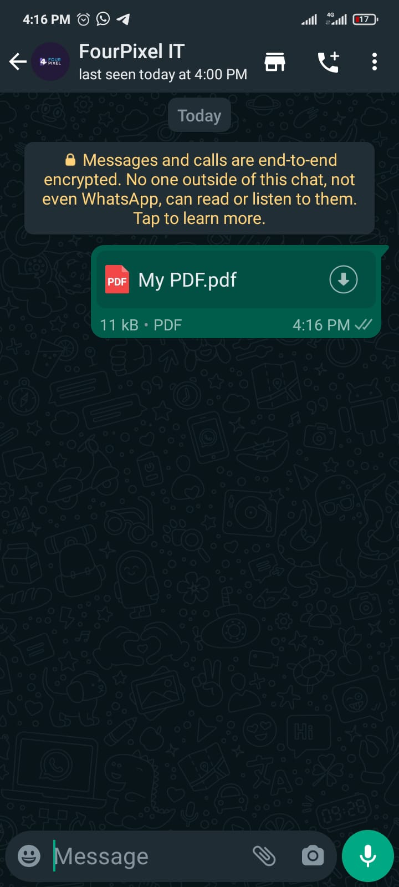

## Method

#### /send-document/{extension}

`POST` https://api.z-api.io/instances/SUA_INSTANCIA/token/SEU_TOKEN/send-document/ **{extension}**


> **Don’t forget!** You need to inform the **{extension}** parameter with the extension of the file you want to send! Theoretically this method should support all types of documents, as long as they are within WhatsApp's own file size policies (to know more about these limits [click here]).

[Click here]: https://developers.facebook.com/docs/whatsapp/api/media/#post-processing

### Size and formats 

O Whatsapp limita o tamanho de arquivos e sua politica muda constantemente, por isso sempre recomendamos a verificação direto no site do próprio Whatsapp.

Neste [link] você encontra tudo que precisa saber sobre formatos e tamanhos de arquivos.

[link]: https://developers.facebook.com/docs/whatsapp/api/media

---

## Concept 

Method responsible for sending documents to your contacts. It is simple and objective.



---

## Attributes

### Mandatory

| Attributes | Type | Description |
| :-- | :-: | :-- |
| phone | string | Recipient (or group ID in case you want to send it to a group) telephone number in the format DDI DDD NUMERS Ex: 551199999999. IMPORTANT  only send numbers without formatting or a mask  |
| document | string | video’s link or its Base64 |

### Opcionais

| Attributes | Type | Description |
| :-- | :-: | :-- |
| fileName | String | Documents name |
| messageId | String | Attribute used to answer a chat message. All you have to do is add the messageID of the message that you want to respond to this attribute |
| delayMessage | number | In this attribute a delay is added to the message. You can decide between a range of 1 - 15 secs (this is for how many seconds it will wait to send the next message EX: “delayMessage”:5,). The default delay is between 1 - 3 secs. |

---

## Request Body

```json
{
  "phone": "5544999999999",
  "document": "https://expoforest.com.br/wp-content/uploads/2017/05/exemplo.pdf",
  "fileName": "Meu PDF"
}
```

---

## Response

### 200

| Attributes | Type   | Description      |
| :-------- | :----- | :------------- |
| zaapId    | string | id on z-api    |
| messageId | string | id on whatsapp |

Example 

```json
{
  "zaapId": "3999984263738042930CD6ECDE9VDWSA",
  "messageId": "D241XXXX732339502B68"
}
```

### 405

In this case certify that you are sending the correct specification of the method. This means, verify if you sent a POST or GET as specified at the beginning of this topic.
### 415

In case you receive 415 error, make sure to add the “Content-Type” of the object you are sending in the request headers, mostly “application/json”

---

## Webhook Response

Link for webhooks response (upon receiving)

[Webhook](../webhooks/on-message-received#exemplo-de-retorno-de-documento)

---

## Code

<iframe src="//api.apiembed.com/?source=https://raw.githubusercontent.com/Z-API/z-api-docs/main/json-examples/send-document.json&targets=all" frameborder="0" scrolling="no" width="100%" height="500px" seamless></iframe>
