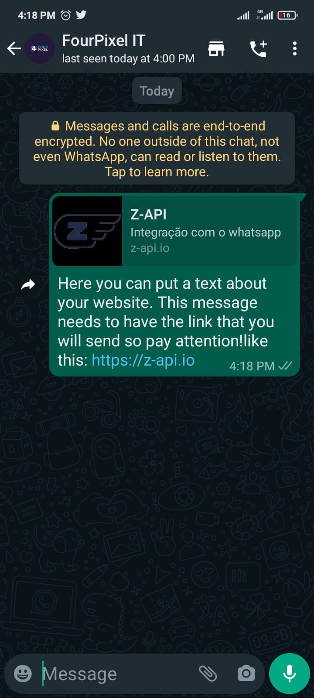

## Method

#### /send-link

`POST` https://api.z-api.io/instances/SUA_INSTANCIA/token/SEU_TOKEN/send-link

---

## Concept

Method responsible for sending links to your contacts, it is used to share links so that the user can be redirected to a website.

:::tip About links

It is important for you to know that the link is only clickable if the recipient already has your phone number in their contacts, or if they start a conversation with you.

:::



---

## Attributes

### Required 

| Attributes | Type | Description |
| :-- | :-: | :-- |
| phone | string | Recipient (or group ID in case you want to send it to a group) telephone number in the format DDI DDD NUMERS Ex: 551199999999. IMPORTANT  only send numbers without formatting or a mask  |
| message | string | Text about your link. **Don’t forget to inform the same value of the linkURL at the end of this text.** |
| image | string | Images link |
| linkUrl | string | Links URL |
| title | string | Title for your link |
| linkDescription | string | Links description |

### Opcionais

| Attributes | Type | Description |
| :-- | :-: | :-- |
| messageId | String | Attribute used to answer a chat message. All you have to do is add the messageID of the message that you want to respond to this attribute |
| delayMessage | number | In this attribute a delay is added to the message. You can decide between a range of 1 - 15 secs (this is for how many seconds it will wait to send the next message EX: “delayMessage”:5,). The default delay is between 1 - 3 secs. |

---

## Request Body

```json
{
  "phone": "5511999998888",
  "message": "Aqui você coloca um texto sobre o site, atenção esse texto preciso ter o link que será enviado no final da mensagem! Assim: https://z-api.io",
  "image": "https://firebasestorage.googleapis.com/v0/b/zaap-messenger-web.appspot.com/o/logo.png?alt=media",
  "linkUrl": "https://z-api.io",
  "title": "Z-API",
  "linkDescription": "Integração com o whatsapp"
}
```

---

## Response

### 200

| Attributes | Type   | Description      |
| :-------- | :----- | :------------- |
| zaapId    | string | id on z-api    |
| messageId | string | id on whatsapp |

Example

```json
{
  "zaapId": "3999984263738042930CD6ECDE9VDWSA",
  "messageId": "D241XXXX732339502B68"
}
```

### 405

In this case certify that you are sending the correct specification of the method. This means, verify if you sent a POST or GET as specified at the beginning of this topic.

### 415

In case you receive 415 error, make sure to add the “Content-Type” of the object you are sending in the request headers, mostly “application/json”

---

## Webhook Response

Link for webhooks response (upon receiving)

[Webhook](../webhooks/on-message-received#exemplo-de-retorno-de-texto)

---

## Code

<iframe src="//api.apiembed.com/?source=https://raw.githubusercontent.com/Z-API/z-api-docs/main/json-examples/send-link.json&targets=all" frameborder="0" scrolling="no" width="100%" height="500px" seamless></iframe>
