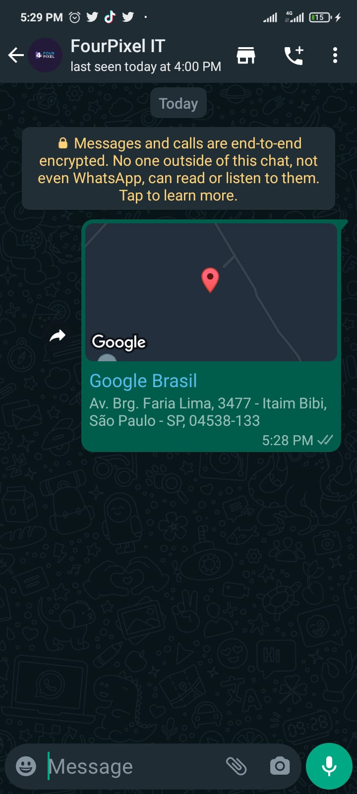

## Method 

#### /send-location

`POST` https://api.z-api.io/instances/SUA_INSTANCIA/token/SEU_TOKEN/send-location

---

## Concept

Method responsible for sending a fixed location to your contacts, it is mostly used to send an address’s location. 



---

## Attributes

### Mandatory

| Attributes | Type | Description |
| :-- | :-: | :-- |
| phone | string | Recipient (or group ID in case you want to send it to a group) telephone number in the format DDI DDD NUMERS Ex: 551199999999. IMPORTANT  only send numbers without formatting or a mask  |
| title | string | Title for your location ex: My house |
| address | string | Location of the address that you are sending along with street, number, neighborhood, city, state and zip code, all separated by a comma |
| latitude | string | Location’s latitude  |
| longitude | string | Location’s longitude  |

### Optionals 

| Attributes | Type | Description |
| :-- | :-: | :-- |
| messageId | String | Attribute used to answer a chat message. All you have to do is add the messageID of the message that you want to respond to this attribute |
| delayMessage | number | In this attribute a delay is added to the message. You can decide between a range of 1 - 15 secs (this is for how many seconds it will wait to send the next message EX: “delayMessage”:5,). The default delay is between 1 - 3 secs. |

---

## Request Body

```json
{
  "phone": "5511999998888",
  "title": "Google Brasil",
  "address": "Av. Brg. Faria Lima, 3477 - Itaim Bibi, São Paulo - SP, 04538-133",
  "latitude": "-23.0696347",
  "longitude": "-50.4357913"
}
```

---

## Response

### 200

| Attributes | Type   | Description      |
| :-------- | :----- | :------------- |
| zaapId    | string | id on z-api    |
| messageId | string | id on whatsapp |

Example 

```json
{
  "zaapId": "3999984263738042930CD6ECDE9VDWSA",
  "messageId": "D241XXXX732339502B68"
}
```

### 405

In this case certify that you are sending the correct specification of the method. This means, verify if you sent a POST or GET as specified at the beginning of this topic.

### 415

In case you receive 415 error, make sure to add the “Content-Type” of the object you are sending in the request headers, mostly “application/json”

---

## Webhook Response

Link for webhooks response (upon receiving)

[Webhook](../webhooks/on-message-received#exemplo-de-retorno-de-localização)

---

## Code

<iframe src="//api.apiembed.com/?source=https://raw.githubusercontent.com/Z-API/z-api-docs/main/json-examples/send-location.json&targets=all" frameborder="0" scrolling="no" width="100%" height="500px" seamless></iframe>
