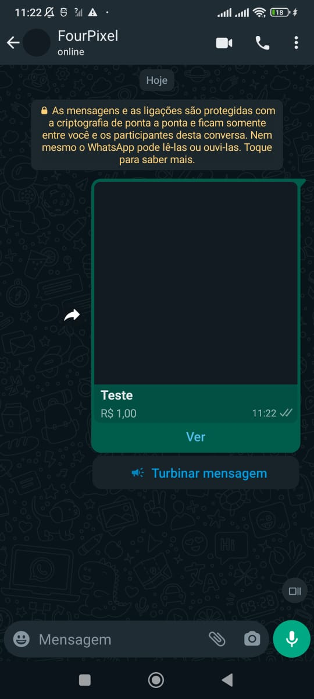

## Method

#### /send-product

`POST` https://api.z-api.io/instances/YOUR_INSTANCE/token/YOUR_TOKEN/send-product

### Header

|      Key       |            Value            |
| :------------: |     :-----------------:     |
|  Client-Token  | **[ACCOUNT SECURITY TOKEN](../security/client-token)** |
---

## Concept

In this method, you can send messages of your products. The product feature is only available for **business** WhatsApp accounts. It is also necessary for the account to have registered products. Operations related to products can be found in the **[Whatsapp Business](../business/get-products.md)** section of our documentation.



---

## Attributes

### Required

| Attributes | Type   | Description |
| :------   | :----: | :------   |
| phone     | string | Recipient's phone number (or group ID for group messages) in the format DDI DDD NUMBER E.g., 551199999999. **IMPORTANT** Send only numbers, without formatting or mask |
| catalogPhone   | string | Phone number of the business account to which the product belongs. |
| productId   | string | Product ID. Can be obtained from the API of **[listing products](../business/get-products.md)** or via **[webhook](../webhooks/on-message-received#product-return-example)**. |

---

## Request Body

```json
{
  "phone": "5511999999999",
  "catalogPhone": "5511999999999",
  "productId": "7190654897637620"
}
```

## Response

### 200

| Atributos | Tipo   | Descrição      |
| :-------- | :----- | :------------- |
| zaapId    | string | id in z-api    |
| messageId | string | id in WhatsApp |
| id        | string | Added for compatibility with Zapier, it has the same value as messageId |


Example

```json
{
  "zaapId": "3999984263738042930CD6ECDE9VDWSA",
  "messageId": "D241XXXX732339502B68",
  "id": "D241XXXX732339502B68"
}
```

### 405

In this case, make sure you are correctly sending the method specification, i.e., check if you sent the POST or GET as specified at the beginning of this topic.

### 415

If you receive a 415 error, make sure to add the "Content-Type" of the object you are sending to the headers of the request, mostly "application/json"

---

## Webhook Response

Link to the webhook response (upon receipt)

[Webhook](../webhooks/on-message-received#product-return-example)

---

## Code

<iframe src="//api.apiembed.com/?source=https://raw.githubusercontent.com/Z-API/z-api-docs/main/json-examples/send-product.json&targets=all" frameborder="0" scrolling="no" width="100%" height="500px" seamless></iframe>
