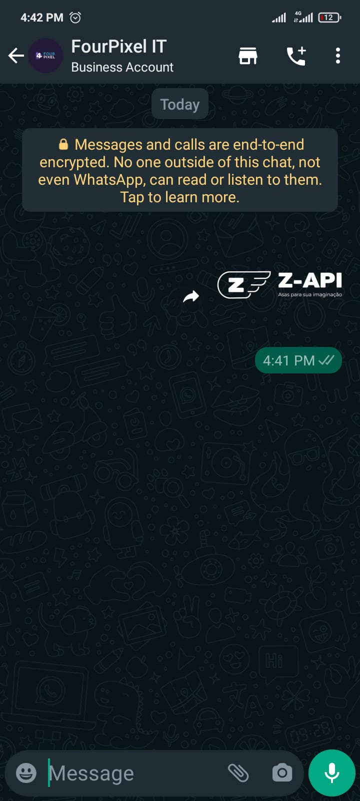

## Method 

#### /send-sticker

`POST` https://api.z-api.io/instances/YOUR_INSTANCE/token/YOUR_TOKEN/send-sticker

### Header

|      Key       |            Value            |
| :------------: |     :-----------------:     |
|  Client-Token  | **[ACCOUNT SECURITY TOKEN](../security/client-token)** |

---

## Concept

This method is responsible for sending images for your chats, you can work with two types of images which are:

- By link, this means that if you have an image that is being hosted somewhere on the internet you can simply just send the link

- By base64, if you opted for this option you will need to have a method in your application to convert an image to base64. To make sure that your conversion worked, copy the generated Base64 and paste it in your browser's address bar, if it's a valid image your browser will be able to render it, if the browser can't, check your method :)

  **_ IMPORTANTE _** se optar por base64 antes do binário você precisa adicionar a seguinte expressão ** data:image/png;base64, \*_ seu codigo base64 _\* **

You can test this type with this type of submission by using an online converter of images to base64.

Examples:

[conversor 1]

[conversor 2]

[conversor 1]: https://www.base64-image.de/
[conversor 2]: https://base64.guru/converter/encode/image

### Sizes and formats

WhatsApp limits the sizes of files and its politics constantly changes and because of that we always recommend that you verify directly on WhatsApp’s website.

In this [link] you can find everything that you need to know about formatting and file sizing.

[link]: https://developers.facebook.com/docs/whatsapp/api/media



---

## Atributos

### Obrigatórios

| Attributes | Type | Description |
| :-- | :-: | :-- |
| phone | string | Recipient (or group ID in case you want to send it to a group) telephone number in the format DDI DDD NUMERS Ex: 551199999999. IMPORTANT  only send numbers without formatting or a mask  |
| sticker | string | Image’s link or its Base64 |

### Opcionais

| Attributes | Type | Description |
| :-- | :-: | :-- |
| messageId | String | Attribute used to answer a chat message. All you have to do is add the messageID of the message that you want to respond to this attribute |
| delayMessage | number | In this attribute a delay is added to the message. You can decide between a range of 1 - 15 secs (this is for how many seconds it will wait to send the next message EX: “delayMessage”:5,). The default delay is between 1 - 3 secs. |
| stickerAuthor | string | Sticker author name |

---

## Request Body

**Sending using URL**
```json
{
  "phone": "5511999999999",
  "sticker": "https://www.z-api.io/wp-content/themes/z-api/dist/images/logo.svg",
  "stickerAuthor": "Z-API"
}
```

**Sending using Bae64**
```json
{
  "phone": "5511999999999",
  "sticker": "data:image/png;base64,iVBORw0KGgoAAAANgoAAAANSUhEUgAAAyAAAAMgCAIAAABUEpE",
  "stickerAuthor": "Z-API"

}
```

---

## Response

### 200

| Attributes | Type   | Description      |
| :-------- | :----- | :------------- |
| zaapId    | string | id on z-api    |
| messageId | string | id on whatsapp |

Example

```json
{
  "zaapId": "3999984263738042930CD6ECDE9VDWSA",
  "messageId": "D241XXXX732339502B68"
}
```

### 405

In this case certify that you are sending the correct specification of the method. This means, verify if you sent a POST or GET as specified at the beginning of this topic.

### 415

In case you receive 415 error, make sure to add the “Content-Type” of the object you are sending in the request headers, mostly “application/json”


## Webhook Response

Link for webhooks response (upon receiving)

[Webhook](../webhooks/on-message-received#exemplo-de-retorno-de-sticker)

---

## Code

<iframe src="//api.apiembed.com/?source=https://raw.githubusercontent.com/Z-API/z-api-docs/main/json-examples/send-sticker.json&targets=all" frameborder="0" scrolling="no" width="100%" height="500px" seamless></iframe>
