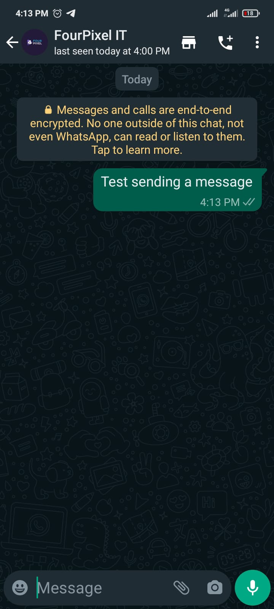

## Method

#### /send-text

`POST` https://api.z-api.io/instances/SUA_INSTANCIA/token/SEU_TOKEN/send-text

---

## Concept

In this method you will be able to send simple texts, you can add to them by using the formatting of text and emojis. In case you don’t know how to do that, you can click the links below and follow the instructions:

- To format texts on WhatsApp [click here] 

- You can also use line breaks in your messages however, this can be done in different ways. This will depend on the platform that you are using as well as the language, up until this moment we have identified the following.


  > - \n
  > - \r
  > - \r\n
  > - %0a

  Identify which will be the most adequate for your case.

  **If you can find a different way of doing a line break please let us know :)**
- Another resource that you can explore and use are emojis,  if need be you can find a few here [link]

[click here]: https://faq.whatsapp.com/general/chats/how-to-format-your-messages/?lang=pt_br
[link]: https://fsymbols.com/pt/emoji/

:::tip Sobre emojis

What you need to know is that it is a normal ASCII character. Just like there are character fonts you can have emoji fonts. You are actually able to create your own gallery of emojis! 


To test this, just copy an emoji and paste into your text! You can use this one 🤪  if you’d like

::: Exemplo no Whatsapp



---

## Attributes

### Mandatory 

| Attributes | Type | Description |
| :-- | :-: | :-- |
| phone | string | Recipient (or group ID in case you want to send it to a group) telephone number in the format DDI DDD NUMERS Ex: 551199999999. IMPORTANT  only send numbers without formatting or a mask |
| message | string | Text to be sent|

### Optional

| Attributes | Type | Description |
| :-- | :-: | :-- |
| delayMessage | number |In this attribute a delay is added to the message. You can decide between a range of 1 - 15 secs (this is for how many seconds it will wait to send the next message EX: “delayMessage”:5,). The default delay is between 1 - 3 secs|
| delayTyping  | number | In this attribute, a delay is added to the message. You can choose from a range of 1 to 15 seconds, which indicates how many seconds it will remain in the "Typing..." status. (For example, "delayTyping": 5). The default delay if not specified is 0.|
| editMessageId | string | This attribute allows you to edit previously sent messages on WhatsApp. Use the message ID and the new content in the JSON to make changes. |

---

## Request Body

```json
{
  "phone": "5511999999999",
  "message": "Welcome to *Z-API*"
}
```

---

## Response

### 200

| Attributes| Type   | Description   |
| :-------- | :----- | :------------- |
| zaapId    | string | id on z-api    |
| messageId | string | id on whatsapp |

Example

```json
{
  "zaapId": "3999984263738042930CD6ECDE9VDWSA",
  "messageId": "D241XXXX732339502B68"
}
```

### 405

In this case certify that you are sending the correct specification of the method. This means, verify if you sent a POST or GET as specified at the beginning of this topic.

### 415

In case you receive 415 error, make sure to add the “Content-Type” of the object you are sending in the request headers, mostly “application/json”

---

## Webhook Response

Link to webhook response (on receipt)

[Webhook](../webhooks/on-message-received#exemplo-de-retorno-de-texto)

---

## Code

<iframe src="//api.apiembed.com/?source=https://raw.githubusercontent.com/Z-API/z-api-docs/main/json-examples/send-text.json&targets=all" frameborder="0" scrolling="no" width="100%" height="500px" seamless></iframe>
