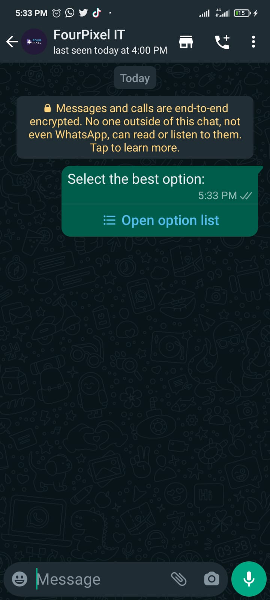

## Method

#### /send-option-list

`POST` https://api.z-api.io/instances/YOUR_INSTANCE/token/YOUR_TOKEN/send-option-list

### Header

|      Key       |            Value            |
| :------------: |     :-----------------:     |
|  Client-Token  | **[ACCOUNT SECURITY TOKEN](../security/client-token)** |

---

## Concept 

In this method you will be able to send text messages with a list of options where the user will be able to choose one of the options sent.



---

## Atributes

### Required 

| Attributes | Type | Description |
| :-- | :-: | :-- |
| phone | string | Recipient (or group ID in case you want to send it to a group) telephone number in the format DDI DDD NUMERS Ex: 551199999999. IMPORTANT  only send numbers without formatting or a mask  |
| message | string | Text to be sent |
| optionList | optionList | List’s configuration  |

### Optionals

| Attributes | Type | Description |
| :-- | :-: | :-- |
| delayMessage | number | In this attribute a delay is added to the message. You can decide between a range of 1 - 15 secs (this is for how many seconds it will wait to send the next message EX: “delayMessage”:5,). The default delay is between 1 - 3 secs. |

### Option List

| Attributes   |  Type  | Description                       |
| :---------- | :----: | :------------------------------ |
| title       | string | Listing title               |
| buttonLabel | string | Button text that opens the list|
| options     | option | Options list                |

### Option

| Attributes   |  Type  | Description          |
| :---------- | :----: | :----------------- |
| description | string | Option’s description |
| title       | string | Options title   |

### Opcionais Button

| Attributes |  Type | Description            |
| :-------- | :----: | :--------------------- |
| id        | string | Identificador da opção |

---

## Request Body

```json
{
  "phone": "5511999999999",
  "message": "Selecione e melhor opção:",
  "optionList": {
    "title": "Opções disponíveis",
    "buttonLabel": "Abrir lista de opções",
    "options": [
      {
        "id": "1",
        "description": "Z-API Asas para sua imaginação",
        "title": "Z-API"
      },
      {
        "id": "2",
        "description": "Não funcionam",
        "title": "Outros"
      }
    ]
  }
}
```

---

## Response

### 200

| Attributes | Type   | Description       |
| :-------- | :----- | :------------- |
| zaapId    | string | id on z-api    |
| messageId | string | id on whatsapp |

Example 

```json
{
  "zaapId": "3999984263738042930CD6ECDE9VDWSA",
  "messageId": "D241XXXX732339502B68"
}
```

### 405

In this case certify that you are sending the correct specification of the method. This means, verify if you sent a POST or GET as specified at the beginning of this topic.

### 415

In case you receive 415 error, make sure to add the “Content-Type” of the object you are sending in the request headers, mostly “application/json”

---

## Webhook Response

Link for webhooks response (upon receiving)

[Webhook](../webhooks/on-message-received#exemplo-de-retorno-de-texto-lista-de-opcão)

---

## Code

<iframe src="//api.apiembed.com/?source=https://raw.githubusercontent.com/Z-API/z-api-docs/main/json-examples/send-option-list.json&targets=all" frameborder="0" scrolling="no" width="100%" height="500px" seamless></iframe>
