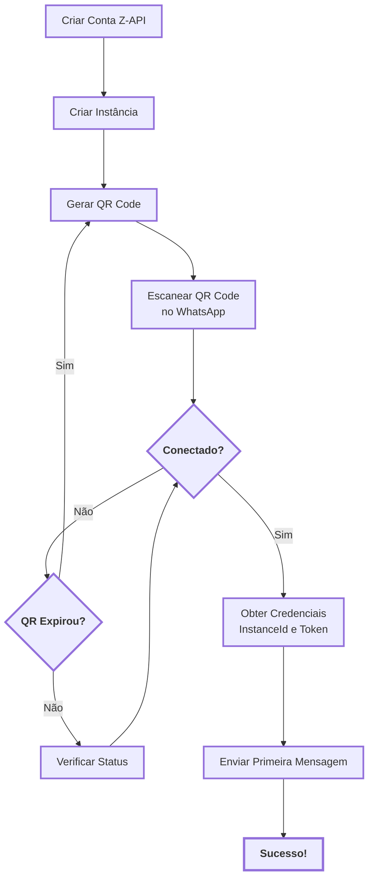
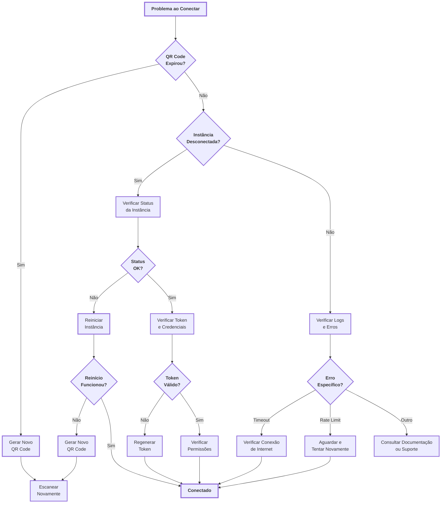

import { UrlDisplay, IdDisplay, PhoneDisplay, RequestBodyDisplay, PathParameterDisplay } from '@site/src/components/shared/HighlightBox';

# <Icon name="Rocket" size="lg" /> Getting Started with the Z-API

Welcome to the quick start guide for the Z-API! This practical and straightforward guide is designed so that you can set up your account and send your first message in just a few minutes, even without prior programming or API experience. Follow the steps below and you will be ready to start automating your communications via WhatsApp.

:::info <Icon name="Clock" size="sm" /> Estimated Time
This guide takes approximately **5-10 minutes** to complete, depending on your experience with APIs and development tools.
:::

:::tip Start Now
This guide was carefully designed to be accessible to everyone. Even without prior programming or API experience, you can set everything up in just a few minutes and send your first automated message!
:::

:::info Additional Article
If you want to understand the concept of an instance before starting, especially if you are beginning to automate, read this article first: [What is an Instance? Understand How Your WhatsApp Becomes a Digital Assistant](/blog/o-que-e-uma-instancia-entenda-como-seu-whatsapp-vira-um-assistente-digital). It explains the concept simply and didactically using everyday analogies.
:::

---

## <Icon name="CheckSquare" size="md" /> What You Need Before Starting

To ensure a smooth process, make sure you have:

- <Icon name="UserCheck" size="sm" /> A **Z-API account** created.
- <Icon name="Smartphone" size="sm" /> An **active smartphone** with WhatsApp that you will use for automation.
- <Icon name="Terminal" size="sm" /> **Access to a computer** to scan the QR Code on the Z-API panel.

:::info Tip
Don't worry if you don't have programming experience. This guide is for everyone!
:::

---

## <Icon name="RefreshCw" size="md" /> Visual Flow: From Creation to Sending

Before you start, see the complete process flow:

<ScrollRevealDiagram direction="up">

</ScrollRevealDiagram>

**Diagram Legend**

This diagram shows the complete process from account creation to sending the first message.

**Main Flow**: Create Account → Instance → QR Code → Scan → Connected → Credentials → Message → Success!

**Alternative Paths**:

- QR Expired? (Yes) → Generate New QR Code
- Connected? (No) → Check Status → Try Again

**Tips**:

- Keep the QR Code visible during scanning
- If the QR expires, generate a new one immediately
- Check instance status if there are connection issues

:::tip Learn to Read Diagrams
Not familiar with flow diagrams? Read our [complete guide on how to interpret diagrams and decision trees](/blog/como-ler-diagramas-fluxos-decisao).
:::

## <Icon name="ListChecks" size="md" /> Step-by-Step: From Configuration to Sending

Follow the steps below to connect your WhatsApp account and send a test message.

### <Icon name="PlusCircle" size="sm" /> Step 1: Create Your Instance

An "instance" is the connection between the Z-API and your WhatsApp account.

1. <Icon name="Terminal" size="xs" /> Access the **Z-API control panel**.
2. <Icon name="MousePointerClick" size="xs" /> In the main menu, find and click on the option to **create a new instance**.
3. <Icon name="Edit3" size="xs" /> Give your instance an easy-to-remember name (e.g., "Sales Automation" or "Customer Support").

:::tip Instance Name
Choose a descriptive name that will make it easier to identify when you have multiple instances in the future.
:::

### <Icon name="QrCode" size="sm" /> Step 2: Connect Your WhatsApp

Now, let's connect your phone to the instance you just created.

1. <Icon name="QrCode" size="xs" /> With the selected instance in the panel, click on the option to **get the QR Code**.
2. <Icon name="Smartphone" size="xs" /> Open **WhatsApp** on your smartphone.
3. <Icon name="Settings" size="xs" /> Go to **Settings > Connected Devices > Connect a Device**.
4. <Icon name="Scan" size="xs" /> Point your phone's camera at the **QR Code** displayed on the Z-API panel.

:::info Wait for Connection
Wait a few moments while the connection is established. Once the status of your instance changes to **"Connected"**, you are ready for the next step!
:::

### <Icon name="Send" size="sm" /> Step 3: Send Your First Message

Let's test the connection by sending a simple text message. For this step, we recommend using **Postman**, a tool that simplifies API testing without needing to write code.

1. <Icon name="KeyRound" size="xs" /> First, make sure you have your **credentials** handy. You can find them in the panel of your instance:
   - <Icon name="IdCard" size="xs" /> **InstanceId**: The unique identifier for your instance.
   - <Icon name="KeySquare" size="xs" /> **Token**: Your secure access key.

2. <Icon name="Code2" size="xs" /> Now, let's use the API to send the message. The request structure will be as follows:

   - **Method:** `POST`
   - **URL:**

   <UrlDisplay
     url="https://api.z-api.io/instances/{instanceId}/token/{token}/send-text"
     instructionText="URL completa do endpoint (substitua {instanceId} e {token} pelos seus valores)"
   />

   - **Request Body (Body):**

   <RequestBodyDisplay
     body={{
       phone: "5511999999999",
       message: "Olá, mundo! Esta é minha primeira mensagem com o Z-API."
     }}
     instructionText="Corpo da requisição em formato JSON"
   />

3. <Icon name="RefreshCw" size="xs" /> Replace the following values with your data:

   - <PathParameterDisplay param="{instanceId}" instructionText="ID da sua instância" />
   - <PathParameterDisplay param="{token}" instructionText="Token da sua instância" />
   - <PhoneDisplay phone="5511999999999" instructionText="Número de telefone do destinatário" />

4. <Icon name="Send" size="xs" /> Send the request! In seconds, the message should arrive at the destination number.

:::success Congratulations!
You just sent your first message using the Z-API!
:::

---

## <Icon name="HelpCircle" size="md" /> Troubleshooting: Common Issues {#troubleshooting}

If you encountered any problems during the process, use this visual guide to identify and resolve them:

<ScrollRevealDiagram direction="up">

</ScrollRevealDiagram>

**Troubleshooting Diagram Legend**

This diagram presents a decision tree to diagnose and resolve common issues.

**Solution Flows**:

- QR Expired? (Yes) → Generate New QR Code → Scan Again
- Instance Disconnected? (Yes) → Check Status → Restart
- Invalid Token? (No) → Regenerate Token
- Specific Error? → Identify Type → Apply Solution

**Tips**:

- Always check the instance status first
- Tokens can expire - make sure you are using the correct one
- Rate limits are temporary - wait a few minutes

:::tip Learn to Read Diagrams
Not familiar with decision trees? Read our [complete guide on how to interpret diagrams and flowcharts](/blog/como-ler-diagramas-fluxos-decisao).
:::

### <Icon name="ListChecks" size="sm" /> Common Problems and Solutions

| Problem | Likely Cause | Solution |
|:------- |:------------- |:------ |
| <Icon name="QrCode" size="xs" /> **QR Code does not appear** | Instance was not created correctly | Check if the instance was created in the panel and try generating the QR Code again |
| <Icon name="Timer" size="xs" /> **QR Code expires too quickly** | WhatsApp limits validity time | Generate a new QR Code immediately after opening the scanning screen |
| <Icon name="Power" size="xs" /> **"Instance disconnected" after scanning** | Connection or invalid session issue | Check your internet connection and try **[restarting the instance](/docs/instance/reiniciar)** |
| <Icon name="KeyRound" size="xs" /> **Error 401 (Unauthorized)** | Invalid or expired token | Check if you are using the correct token in the header `Client-Token` |
| <Icon name="Clock" size="xs" /> **Error 429 (Too many requests)** | Rate limit exceeded | Wait a few minutes before trying again |
| <Icon name="MessageSquare" size="xs" /> **Message not sent** | Instance disconnected or invalid number | Check the instance status and the format of the number (must include country code) |

:::tip Pro Tip
If the problem persists, check the logs for your instance in the Z-API panel. They usually contain detailed information about what is happening.
:::

---

## <Icon name="Rocket" size="md" /> Next Steps

Now that you have mastered the basics, here are some suggestions of what to explore next:

- <Icon name="Plug" size="sm" /> **[Postman Collection](/docs/quick-start/colecao-postman)** - Learn to use our complete Postman collection to test all API functionalities visually.
- <Icon name="MessageSquare" size="sm" /> **[Message Types](/docs/messages/introducao)** - Discover how to send images, videos, documents, and messages with buttons.
- <Icon name="Webhook" size="sm" /> **[Webhooks](/docs/webhooks/introducao)** - Configure notifications to be alerted in real time when you receive new messages.
- <Icon name="ShieldAlert" size="sm" /> **[Best Practices: Avoiding Blocks](/docs/quick-start/bloqueios-e-banimentos)** - Read our essential guide for using automation safely and efficiently.

:::tip Keep Learning
Each section of the documentation was designed to guide you step by step. Explore at your own pace and don't hesitate to consult the example code!
:::