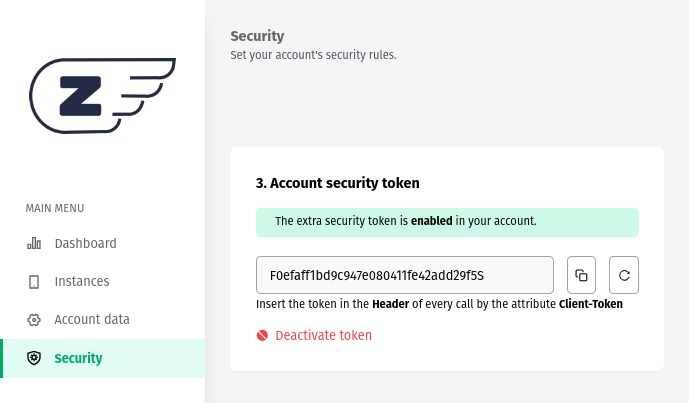

### **Account security token**

This Z-API security method uses token validation, providing an additional layer of protection for your instances, ensuring that only authorized requests have access to your resources.

## Activating the feature.

To enable the token validation feature, follow these simple steps:

1. Log in to your Z-API account.

2. In the "Security" tab, find the "Account Security Token" module.

3. Click on the "Configure now" option. This will generate a token, which will initially be disabled to prevent disruptions to your application's operation.



## Basic Operation

The operation of the token-based security method is straightforward:

1. After generating the token, it should be included in the header of all your HTTP requests.

2. The token should be passed as follows:
   - **Attribute**: Client-Token
   - **Value**: [token]

3. After configuring your environment to send the token in requests, you can click on "Activate Token."

4. From this moment onwards, all instances of your application will only accept requests that contain the token in the header.

## Behavior of Unregistered Token

If a request is made without the configured token, the API will respond with an error, as shown in the example below:

```json
{
    "error": "null not allowed"
}
```

This ensures that only authorized requests with the token are processed.

## Benefits of Token Validation

Token validation offers numerous benefits for the security of your application:

1. **Advanced Protection**: The token adds an additional layer of authentication, safeguarding your application against unauthorized access.

2. **Total Control**: You have full control over who can access your instances, ensuring that only legitimate requests are served.

With token validation enabled, your Z-API application will be more secure and protected against cyber threats, ensuring the integrity and confidentiality of your data. Be sure to configure and activate this feature in all relevant instances to keep your application secure.