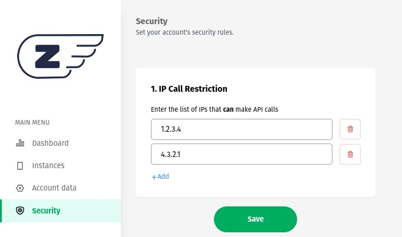

### **IP Restriction**

The IP blocking security method introduces an additional layer of protection, allowing users to restrict API calls based on the IP addresses of the requesters. This means you can control which IPs are allowed to access your API and which ones are blocked. Below, we detail how this feature works:

### **Activating the Feature**

To activate this feature, follow the simple steps below:

1. Log in to Z-API:
   Access the Z-API control panel using your administrator credentials.

2. Navigate to the Security Page:
   In the Z-API dashboard, find the "Security" option in the navigation menu or settings area.



### **Basic Operation:**

When the IP Restriction module is not activated, the API operates normally and allows access from any IP address that makes a request. This is suitable for situations where no IP restriction is needed, and the API should be publicly accessible.

### **Behavior of Unregistered IP:**

When a request is made from an IP address that is not on the list of allowed IPs, the API responds with a clear error message:

```json
{
    "error": "[IP request] not allowed"
}
```
---

### **Benefits of IP Blocking:**

1. **Control:** With this functionality, you have full control over who can access your API, allowing only trusted IPs.

2. **Protection Against Threats:** IP restriction helps protect your API against unauthorized access, attempted attacks, and other security threats.

3. **Security Compliance:** For businesses that need to comply with strict security regulations, this feature can be essential.

The IP Blocking security method makes your API more secure, providing complete control over who can access it and ensuring that only authorized IPs are permitted to use the API's resources. This functionality is especially useful for safeguarding sensitive data, preventing abuse, and maintaining the integrity of your API.