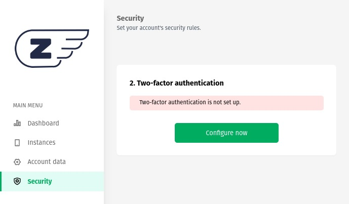

### **Two-Factor Security:**
Implementing an additional authentication step, known as two-factor authentication (2FA), in the Z-API dashboard is an essential security measure to protect your information and instances from unauthorized access. This extra layer of protection requires you to provide a second authentication factor in addition to your regular password when logging in.

### **Activating the Feature:**
To enable two-factor authentication in the Z-API dashboard, follow these steps:

1. Access the Z-API dashboard and log in with your existing credentials.
2. Navigate to the "Security" section.
3. Locate the "Two-Factor Authentication" option and click "Configure Now."

After clicking on "Configure now" the system will generate a unique QR code. This QR code should be synchronized with an authenticator app such as 1Password, Google Authenticator, or Microsoft Authenticator on your mobile device. The authenticator app will be used as the second factor of authentication.

### **Operation**
1. Open the authenticator app on your mobile device.
2. Add a new account manually or scan the QR code generated by the Z-API dashboard.
3. The authenticator app will link your Z-API account to your device.
4. Now, every time you log in to the Z-API dashboard, you will be prompted to provide a one-time use code generated by the authenticator app.
5. This one-time use code is generated every few seconds and is unique to your account, meaning that no one else can access your account even if they know your password.

---

### **Benefits of Using 2FA**

Implementing two-factor authentication offers several benefits for the security of your Z-API account:

1. **Additional Protection:** Even if someone knows your password, they cannot access your account without the second factor of authentication.

2. **Prevention Against Unauthorized Access:** 2FA significantly complicates unauthorized access attempts, as it requires an additional element that only the account holder possesses (their mobile device).

3. **Security for Sensitive Data:** If you are dealing with confidential or critical information, two-factor authentication is a crucial measure to ensure the integrity of this data.

4. **Compliance with Security Standards:** In many industries and regulations, two-factor authentication is a requirement to comply with security standards.

Two-factor authentication is a vital layer of security that protects your accounts and information in the Z-API dashboard against cyber threats, making unauthorized access much more challenging and ensuring the integrity of your data. It is highly recommended to enable this feature to enhance the security of your operations.