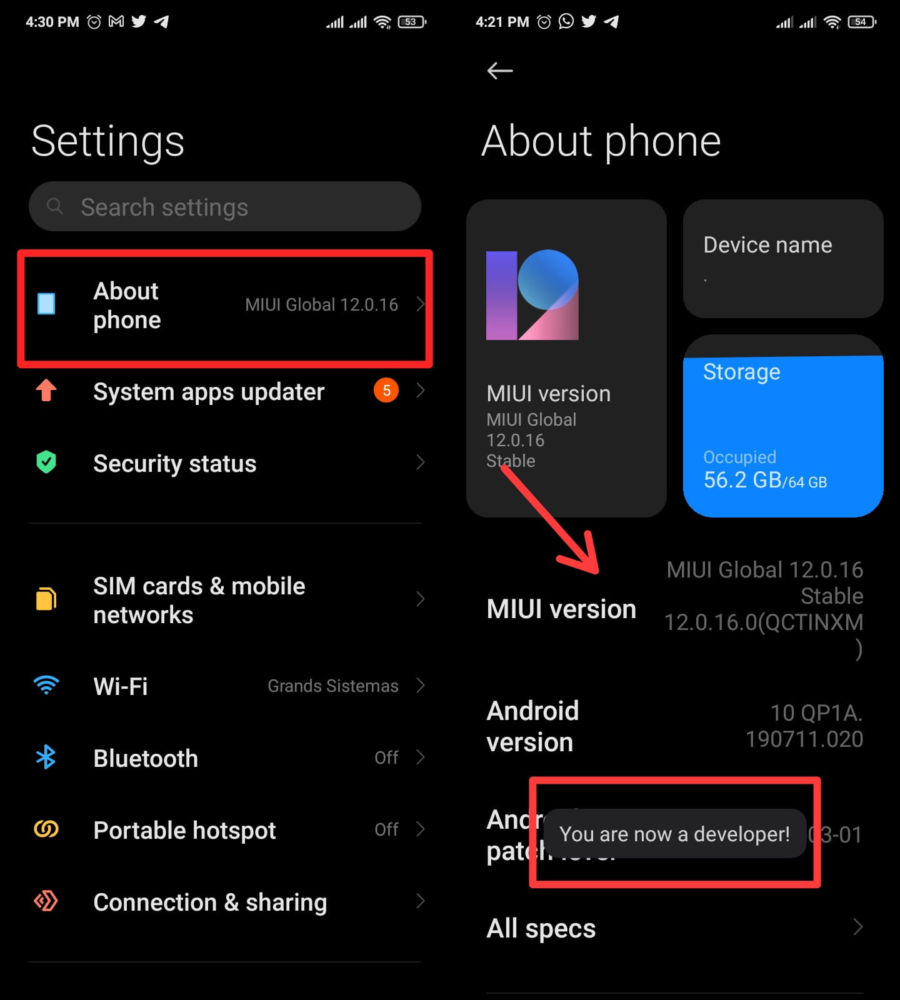
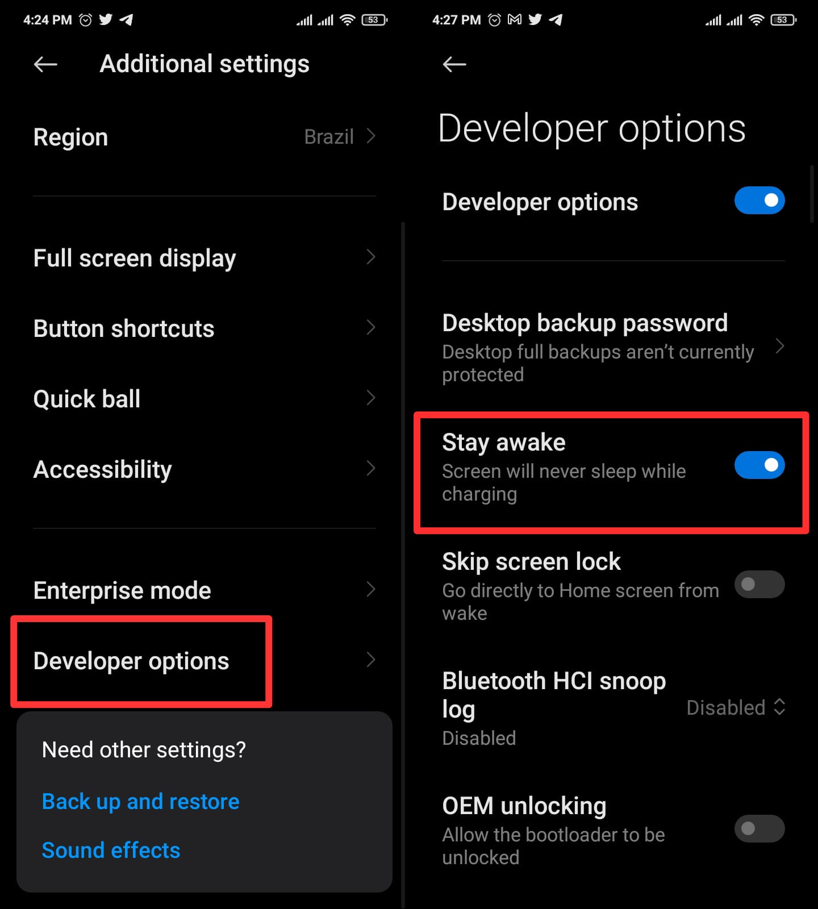

## Introduction

Every good dev knows how much apple can make our lives difficult, am i right? Which brings me to the point that we unfortunately don´t have a tutorial on how to keep IOS devices always active. If you happen to find out or already know how to do that on IOS please be sure to let us know and we'll be more than happy to rectify this topic :)

Going back to Android, below we've listed 3 steps on how to keep your Android always active and how to keep your connection with Z-API running clean.

### First step 

You will need to enable development mode. For this you will need to go to our phone`s settings. Once you're there go to “system'' then “about your system”. Click on the version’s number 7 times and you're done.

---

### Second Step

After activating the developer options you will be asked to confirm your screen unlock method. When you return to the previous menu you will notice that more options will be available at the bottom of the menu.

---

### Terceiro passo

Now that we have developer options. In the menu choose the option “stay awake”. With this option enabled the device’s screen will always stay on even while charging its battery!

