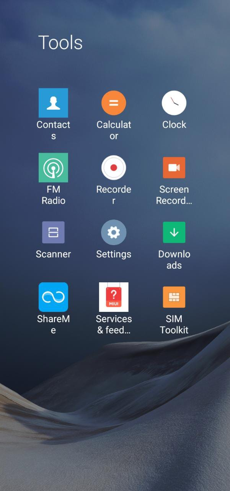
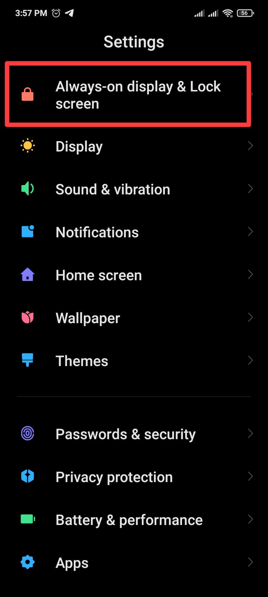
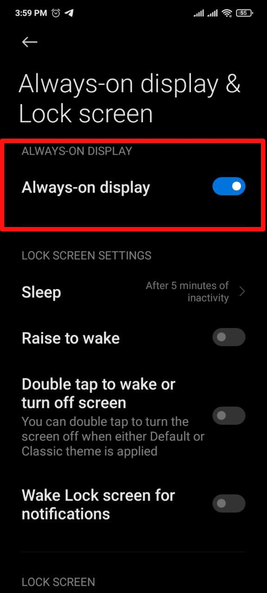
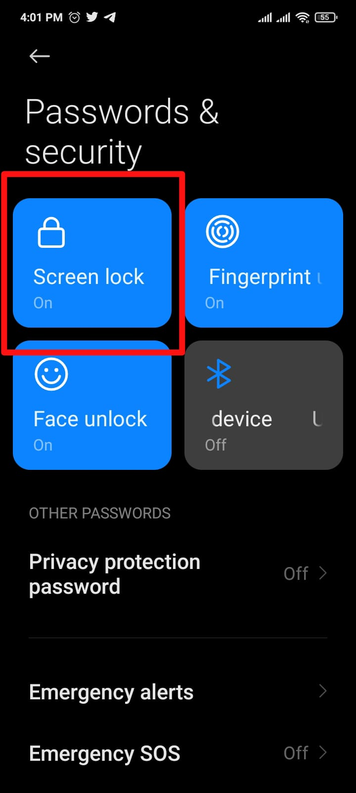
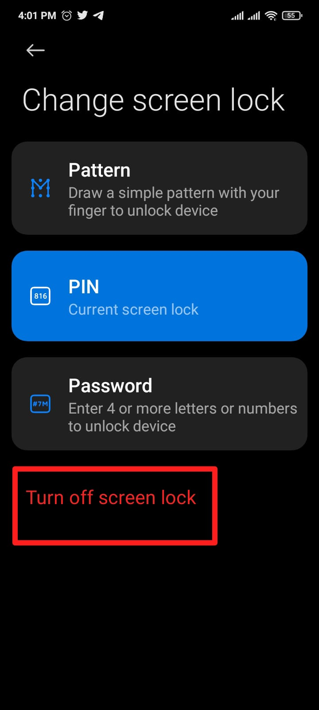
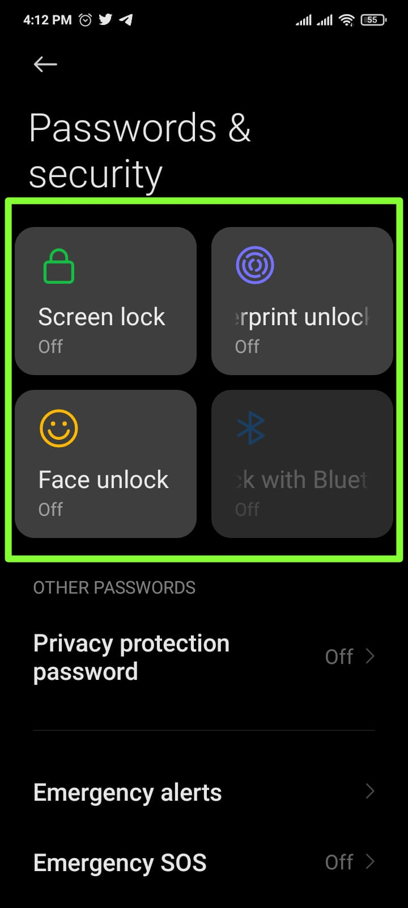

## Introduction 

Like you might have already noticed when your phone locks and brings you to the lockscreen. WhatsApp will stop running in the background which might make you lose your connection to the internet and WhatsApp Web. In this case, if you are using Z-API your connection to it will be affected. For this, we made a step by step guide on how to avoid this issue.

**The examples below were made on an Android**

### First step 

Access Android's settings

### Second step

Go to “Always-on display & Lock screen”

---

### Third step

Select the option “always-on display”

---

### Fourth step

Right after go to passwords and security.

---

### Fifth step

Click on "turn off screen lock"

---

### Sixth step

Turn off screen locks

---

