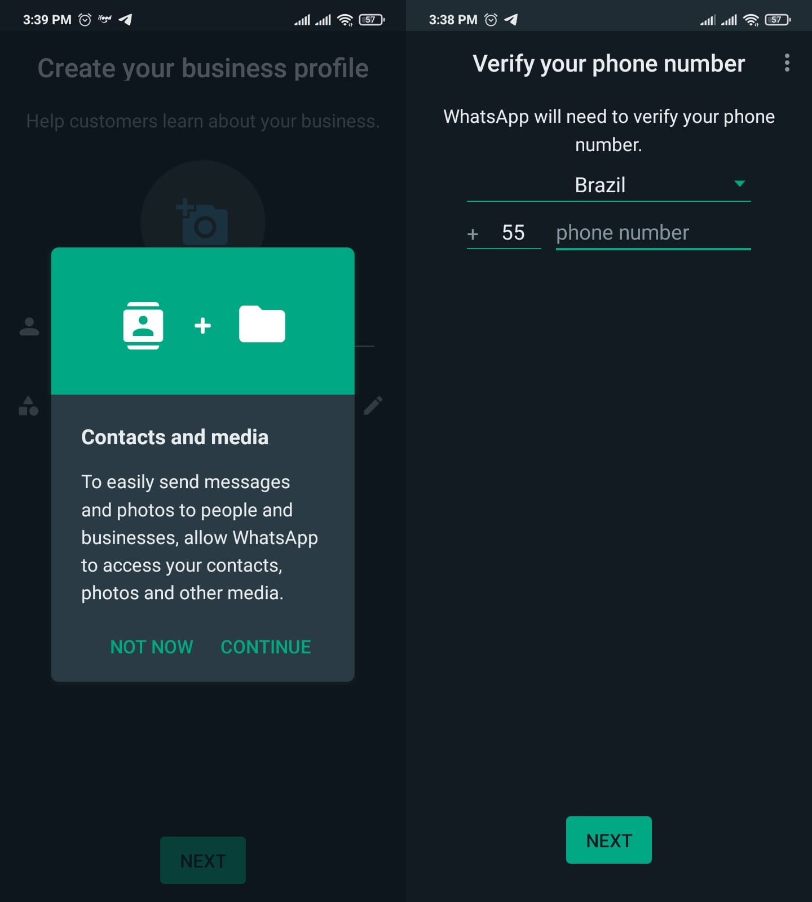
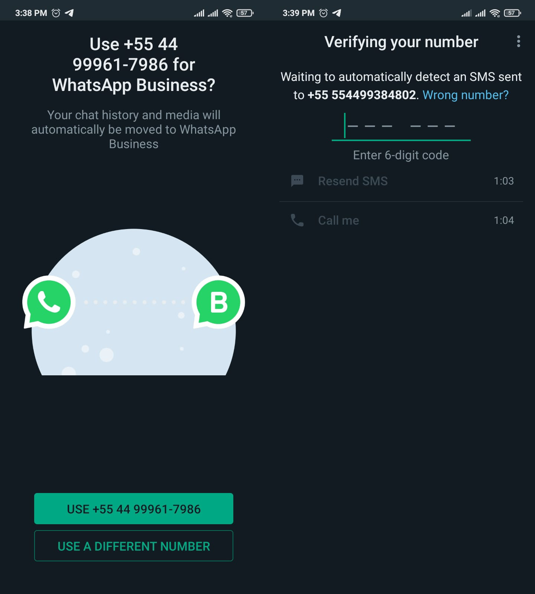

## Introduction 

To enable a fixed number, you need to have a cellphone in order to host your fixed number. (This option is available for WhatsApp business). In this step by step guide that we created we used an Android. 

### First step

Download the app “WhatsApp business” on your phone.

[Android]

[IOS]

[android]: https://play.google.com/store/apps/details?id=com.whatsapp.w4b&hl=pt_BR&gl=US
[ios]: https://apps.apple.com/us/app/whatsapp-business/id1386412985

---

### Second step 

WhatsApp business will ask for your permission to access the files on your phone, choose the continue option to allow them to do so. On the following screen, choose your country and enter your fixed number. 

---

### Third step

You will receive a code, however since you can't receive texts on a fixed number, wait until the timer counts down and gives you the **call me** option.

---

### Fourth step
Be happy!

Make any alterations to your settings on WhatsApp business and read Z-API’s QrCode to give wings to your imagination !