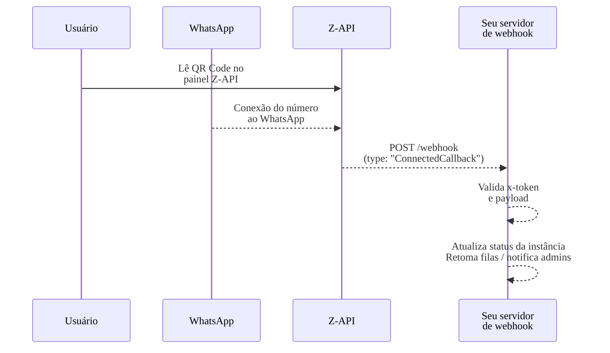

import Tabs from '@theme/Tabs';
import TabItem from '@theme/TabItem';

# Webhook: On connect

Receive notifications whenever your Z-API instance successfully connects (or reconnects) to WhatsApp.
In practice, this is the **"everything is ready" signal** — the instance can be treated as
<strong className="text--success">ONLINE and ready to send messages</strong> in your dashboard:

- **Enable send buttons** in your dashboard or backend
- **Resume pending message queues**
- **Update instance status dashboards**

> **Quick analogy:**
> Think of the instance as a store and the `connected` webhook as the manager's announcement:
> **"We've opened the doors and can now serve customers."**

---

## Event and payload {#evento}

When the connection is established, Z-API sends a POST to your webhook endpoint with a JSON like this:

```json
{
  "type": "ConnectedCallback",
  "connected": true,
  "momment": 26151515154,
  "instanceId": "instance.id",
  "phone": "número"
}
```

### Attributes

| Attributes | Type | Description |
|:----------|:-----|:----------|
| `connected` | boolean | instance status. |
| `phone` | string | Connected number. |
| `momment` | integer | Moment when the instance was disconnected from the number. |
| `type` | string | Type of instance event, in this case it will be "ConnectedCallback". |
| `instanceId` | string | Instance identifier. |

---

## High-level webhook flow {#fluxo}

The diagram below shows the typical flow from reading the QR Code to receiving the webhook on your backend:



> **Mental summary:**
> 1. You connect the number by reading the QR Code.
> 2. Z-API confirms that WhatsApp is online.
> 3. Z-API calls your `connected` webhook.
> 4. Your system marks the instance as "online" and releases flows that depend on it.

---

## When this webhook is called {#quando-este-webhook-e-chamado}

The `connected` event is triggered whenever the instance becomes ready for use again:

- When the instance connects for the **first time** after reading the QR Code
- When the instance **automatically reconnects** after a connection drop
- When the instance is **restarted** (via dashboard or API) and successfully reconnects

> **Best practice:**
> Use this event as the **single source of truth** that this instance can send and receive messages at that moment.

---

## Code Examples

<Tabs>
<TabItem value="javascript" label="JavaScript (Fetch)" default>

```javascript
// ⚠️ SEGURANÇA: Use variáveis de ambiente para credenciais
// Nunca commite tokens no código-fonte
const webhookToken = process.env.ZAPI_WEBHOOK_TOKEN || 'SEU_TOKEN_DE_SEGURANCA';

// Validação de entrada (segurança)
function validateWebhookPayload(payload) {
  if (!payload || typeof payload !== 'object') {
    throw new Error('Payload inválido');
  }
  if (!payload.type || payload.type !== 'ConnectedCallback') {
    throw new Error('Tipo de evento inválido');
  }
  return true;
}

// Processar webhook de conexão
async function handleConnectedWebhook(request) {
  try {
    // ⚠️ SEGURANÇA: Validar token do webhook
    const receivedToken = request.headers.get('x-token');
    if (receivedToken !== webhookToken) {
      return new Response('Unauthorized', { status: 401 });
    }

    const payload = await request.json();
    validateWebhookPayload(payload);

    if (payload.type === 'ConnectedCallback') {
      const { instanceId, connected, momment, phone } = payload;
      
      // ⚠️ SEGURANÇA: Não logue dados sensíveis
      console.log(`Instância ${instanceId} conectada`);
      console.log(`Status: ${connected ? 'Conectado' : 'Desconectado'}`);
      console.log(`Telefone: ${phone}`);
      console.log(`Conectado em: ${new Date(momment).toISOString()}`);

      // 1. Atualizar status da instância no banco de dados
      await updateInstanceStatus(instanceId, 'connected', {
        lastConnectedAt: new Date(momment),
        phone
      });

      // 2. Notificar time de operações / administradores
      await notifyAdmins(`Instância ${instanceId} está online e pronta para uso.`);

      // 3. Retomar filas de mensagens pendentes
      await resumePendingMessages(instanceId);

      // 4. Registrar evento para auditoria
      await auditLog('ConnectedCallback', { instanceId, connected, momment, phone });
    }

    // Sempre responda rápido para não bloquear o Z-API
    return new Response(JSON.stringify({ status: 'OK' }), {
      status: 200,
      headers: { 'Content-Type': 'application/json' },
    });
  } catch (error) {
    // ⚠️ SEGURANÇA: Tratamento genérico de erro
    console.error('Erro ao processar webhook:', error.message);
    return new Response(JSON.stringify({ error: 'Erro ao processar webhook' }), {
      status: 500,
      headers: { 'Content-Type': 'application/json' },
    });
  }
}

// Funções auxiliares (exemplo)
async function updateInstanceStatus(instanceId, status, metadata) {
  // Em produção, substitua por chamada real ao banco de dados
  console.log(`Atualizando instância ${instanceId} para status ${status}`);
}

async function notifyAdmins(message) {
  // Em produção, implemente notificação real (Slack, email, etc.)
  console.log(`Notificação: ${message}`);
}

async function resumePendingMessages(instanceId) {
  // Em produção, implemente retomada de filas
  console.log(`Retomando mensagens pendentes para instância ${instanceId}`);
}

async function auditLog(event, data) {
  // Em produção, implemente logging estruturado
  console.log(`Audit: ${event}`, data);
}

// Exemplo de uso (Cloudflare Workers, Vercel, etc.)
export default {
  async fetch(request) {
    if (request.method === 'POST' && request.url.endsWith('/webhook')) {
      return handleConnectedWebhook(request);
    }
    return new Response('Not Found', { status: 404 });
  },
};
```

</TabItem>
<TabItem value="typescript" label="TypeScript">

```typescript
// Tipos para melhor type safety
interface ConnectedWebhookPayload {
  type: 'ConnectedCallback';
  instanceId: string;
  connected: boolean;
  momment: number;
  phone: string;
}

// ⚠️ SEGURANÇA: Use variáveis de ambiente para credenciais
const webhookToken: string = process.env.ZAPI_WEBHOOK_TOKEN || 'SEU_TOKEN_DE_SEGURANCA';

// Validação de entrada (segurança)
function validateWebhookPayload(payload: any): payload is ConnectedWebhookPayload {
  if (!payload || typeof payload !== 'object') {
    throw new Error('Payload inválido');
  }
  if (payload.type !== 'ConnectedCallback') {
    throw new Error('Tipo de evento inválido');
  }
  return true;
}

// Processar webhook de conexão
async function handleConnectedWebhook(request: Request): Promise<Response> {
  try {
    // ⚠️ SEGURANÇA: Validar token do webhook
    const receivedToken = request.headers.get('x-token');
    if (receivedToken !== webhookToken) {
      return new Response('Unauthorized', { status: 401 });
    }

    const payload: ConnectedWebhookPayload = await request.json();
    validateWebhookPayload(payload);

    const { instanceId, connected, momment, phone } = payload;

    console.log(`Instância ${instanceId} conectada`);
    console.log(`Status: ${connected ? 'Online' : 'Offline'}`);
    console.log(`Telefone: ${phone}`);
    console.log(`Conectado em: ${new Date(momment).toISOString()}`);

    // Atualizar status da instância no banco de dados
    await updateInstanceStatus(instanceId, 'connected', {
      lastConnectedAt: new Date(momment),
      phone
    });

    // Notificar administradores
    await notifyAdmins(`Instância ${instanceId} está online e pronta para uso.`);

    // Retomar filas de mensagens pendentes
    await resumePendingMessages(instanceId);

    // Registrar evento para auditoria
    await auditLog('ConnectedCallback', { instanceId, connected, momment, phone });

    return new Response(JSON.stringify({ status: 'OK' }), {
      status: 200,
      headers: { 'Content-Type': 'application/json' },
    });
  } catch (error) {
    console.error('Erro ao processar webhook:', error instanceof Error ? error.message : 'Erro desconhecido');
    return new Response(JSON.stringify({ error: 'Erro ao processar webhook' }), {
      status: 500,
      headers: { 'Content-Type': 'application/json' },
    });
  }
}

// Funções auxiliares
async function updateInstanceStatus(instanceId: string, status: string, metadata: any): Promise<void> {
  console.log(`Atualizando instância ${instanceId} para status ${status}`);
}

async function notifyAdmins(message: string): Promise<void> {
  console.log(`Notificação: ${message}`);
}

async function resumePendingMessages(instanceId: string): Promise<void> {
  console.log(`Retomando mensagens pendentes para instância ${instanceId}`);
}

async function auditLog(event: string, data: any): Promise<void> {
  console.log(`Audit: ${event}`, data);
}
```

</TabItem>
<TabItem value="python" label="Python (Requests)">

```python
import os
from flask import Flask, request, jsonify
from typing import Dict, Any

# ⚠️ SEGURANÇA: Use variáveis de ambiente para credenciais
webhook_token = os.getenv('ZAPI_WEBHOOK_TOKEN', 'SEU_TOKEN_DE_SEGURANCA')

app = Flask(__name__)

# Validação de entrada (segurança)
def validate_webhook_payload(payload: Dict[str, Any]) -> bool:
    if not payload or not isinstance(payload, dict):
        raise ValueError('Payload inválido')
    if payload.get('type') != 'ConnectedCallback':
        raise ValueError('Tipo de evento inválido')
    return True

@app.route('/webhook', methods=['POST'])
def webhook():
    try:
        # ⚠️ SEGURANÇA: Validar token do webhook
        received_token = request.headers.get('x-token')
        if received_token != webhook_token:
            return jsonify({'error': 'Unauthorized'}), 401

        payload = request.json
        validate_webhook_payload(payload)

        if payload.get('type') == 'ConnectedCallback':
            instance_id = payload.get('instanceId')
            connected = payload.get('connected')
            momment = payload.get('momment')
            phone = payload.get('phone')

            # ⚠️ SEGURANÇA: Não logue dados sensíveis
            print(f'Instância {instance_id} conectada')
            print(f'Status: {"Conectado" if connected else "Desconectado"}')
            print(f'Telefone: {phone}')
            print(f'Conectado em: {momment}')

            # Atualizar status da instância no banco de dados
            update_instance_status(instance_id, 'connected', {
                'lastConnectedAt': momment,
                'phone': phone
            })

            # Notificar administradores
            notify_admins(f'Instância {instance_id} está online e pronta para uso.')

            # Retomar filas de mensagens pendentes
            resume_pending_messages(instance_id)

            # Registrar evento para auditoria
            audit_log('ConnectedCallback', {
                'instanceId': instance_id,
                'connected': connected,
                'momment': momment,
                'phone': phone
            })

        # Sempre responda rápido para não bloquear o Z-API
        return jsonify({'status': 'OK'}), 200
    except Exception as e:
        # ⚠️ SEGURANÇA: Tratamento genérico de erro
        print(f'Erro ao processar webhook: {str(e)}')
        return jsonify({'error': 'Erro ao processar webhook'}), 500

# Funções auxiliares
def update_instance_status(instance_id: str, status: str, metadata: Dict[str, Any]):
    print(f'Atualizando instância {instance_id} para status {status}')

def notify_admins(message: str):
    print(f'Notificação: {message}')

def resume_pending_messages(instance_id: str):
    print(f'Retomando mensagens pendentes para instância {instance_id}')

def audit_log(event: str, data: Dict[str, Any]):
    print(f'Audit: {event}', data)

if __name__ == '__main__':
    app.run(port=3000)
```

</TabItem>
<TabItem value="curl" label="cURL">

```bash
# ⚠️ SEGURANÇA: Use variáveis de ambiente para credenciais
# Configure via: export ZAPI_WEBHOOK_TOKEN="seu-token"
WEBHOOK_TOKEN="${ZAPI_WEBHOOK_TOKEN:-SEU_TOKEN_DE_SEGURANCA}"

# Exemplo de teste do webhook (simulando requisição do Z-API)
# ⚠️ SEGURANÇA: Sempre use HTTPS (nunca HTTP)
curl -X POST "https://seu-servidor.com/webhook" \
  -H "Content-Type: application/json" \
  -H "x-token: ${WEBHOOK_TOKEN}" \
  -d '{
    "type": "ConnectedCallback",
    "instanceId": "instance.id",
    "connected": true,
    "momment": 26151515154,
    "phone": "número"
  }' \
  --fail-with-body \
  --max-time 30

# ⚠️ SEGURANÇA: Limpe variáveis sensíveis após uso (opcional)
unset WEBHOOK_TOKEN
```

</TabItem>
<TabItem value="nodejs" label="Node.js (Native HTTPS)">

```javascript
const http = require('http');
const crypto = require('crypto');

// ⚠️ SEGURANÇA: Use variáveis de ambiente para credenciais
const webhookToken = process.env.ZAPI_WEBHOOK_TOKEN || 'SEU_TOKEN_DE_SEGURANCA';

// Validação de entrada (segurança)
function validateWebhookPayload(payload) {
  if (!payload || typeof payload !== 'object') {
    throw new Error('Payload inválido');
  }
  if (payload.type !== 'ConnectedCallback') {
    throw new Error('Tipo de evento inválido');
  }
  return true;
}

// Funções auxiliares
function updateInstanceStatus(instanceId, status, metadata) {
  console.log(`Atualizando instância ${instanceId} para status ${status}`);
}

function notifyAdmins(message) {
  console.log(`Notificação: ${message}`);
}

function resumePendingMessages(instanceId) {
  console.log(`Retomando mensagens pendentes para instância ${instanceId}`);
}

function auditLog(event, data) {
  console.log(`Audit: ${event}`, data);
}

const server = http.createServer((req, res) => {
  if (req.method === 'POST' && req.url === '/webhook') {
    let body = '';

    req.on('data', (chunk) => {
      body += chunk.toString();
    });

    req.on('end', () => {
      try {
        // ⚠️ SEGURANÇA: Validar token do webhook (usando timing-safe comparison)
        const providedToken = req.headers['x-token'];
        if (!providedToken || !crypto.timingSafeEqual(
          Buffer.from(providedToken),
          Buffer.from(webhookToken)
        )) {
          res.writeHead(401, { 'Content-Type': 'application/json' });
          res.end(JSON.stringify({ error: 'Unauthorized' }));
          return;
        }

        const payload = JSON.parse(body);
        validateWebhookPayload(payload);

        if (payload.type === 'ConnectedCallback') {
          const { instanceId, connected, momment, phone } = payload;

          console.log(`Instância ${instanceId} conectada`);
          console.log(`Status: ${connected ? 'Conectado' : 'Desconectado'}`);
          console.log(`Telefone: ${phone}`);
          console.log(`Conectado em: ${new Date(momment).toISOString()}`);

          // Atualizar status da instância no banco de dados
          updateInstanceStatus(instanceId, 'connected', {
            lastConnectedAt: new Date(momment),
            phone
          });

          // Notificar administradores
          notifyAdmins(`Instância ${instanceId} está online e pronta para uso.`);

          // Retomar filas de mensagens pendentes
          resumePendingMessages(instanceId);

          // Registrar evento para auditoria
          auditLog('ConnectedCallback', { instanceId, connected, momment, phone });
        }

        // Sempre responda rápido para não bloquear o Z-API
        res.writeHead(200, { 'Content-Type': 'application/json' });
        res.end(JSON.stringify({ status: 'OK' }));
      } catch (error) {
        console.error('Erro ao processar webhook:', error.message);
        res.writeHead(500, { 'Content-Type': 'application/json' });
        res.end(JSON.stringify({ error: 'Erro ao processar webhook' }));
      }
    });
  } else {
    res.writeHead(404, { 'Content-Type': 'application/json' });
    res.end(JSON.stringify({ error: 'Not Found' }));
  }
});

server.listen(3000, () => {
  console.log('Webhook server rodando na porta 3000');
});
```

</TabItem>
<TabItem value="nodejs-express" label="Node.js (Express)">

```javascript
const express = require('express');
const crypto = require('crypto');

const app = express();
app.use(express.json());

// ⚠️ SEGURANÇA: Use variáveis de ambiente para credenciais
const webhookToken = process.env.ZAPI_WEBHOOK_TOKEN || 'SEU_TOKEN_DE_SEGURANCA';

// Validação de entrada (segurança)
function validateWebhookPayload(payload) {
  if (!payload || typeof payload !== 'object') {
    throw new Error('Payload inválido');
  }
  if (payload.type !== 'ConnectedCallback') {
    throw new Error('Tipo de evento inválido');
  }
  return true;
}

app.post('/webhook', (req, res) => {
  try {
    // ⚠️ SEGURANÇA: Validar token do webhook (usando timing-safe comparison)
    const providedToken = req.header('x-token');
    if (!providedToken || !crypto.timingSafeEqual(
      Buffer.from(providedToken),
      Buffer.from(webhookToken)
    )) {
      return res.status(401).json({ error: 'Unauthorized' });
    }

    const payload = req.body;
    validateWebhookPayload(payload);

    if (payload.type === 'ConnectedCallback') {
      const { instanceId, connected, momment, phone } = payload;
      
      console.log(`Instância ${instanceId} conectada`);
      console.log(`Status: ${connected ? 'Conectado' : 'Desconectado'}`);
      console.log(`Telefone: ${phone}`);
      console.log(`Conectado em: ${new Date(momment).toISOString()}`);

      // Atualizar status da instância no banco de dados
      updateInstanceStatus(instanceId, 'connected', {
        lastConnectedAt: new Date(momment),
        phone
      });

      // Notificar administradores
      notifyAdmins(`Instância ${instanceId} está online e pronta para uso.`);

      // Retomar filas de mensagens pendentes
      resumePendingMessages(instanceId);

      // Registrar evento para auditoria
      auditLog('ConnectedCallback', { instanceId, connected, momment, phone });
    }

    // Sempre responda rápido para não bloquear o Z-API
    res.status(200).json({ status: 'OK' });
  } catch (error) {
    console.error('Erro ao processar webhook:', error.message);
    res.status(500).json({ error: 'Erro ao processar webhook' });
  }
});

// Funções auxiliares
function updateInstanceStatus(instanceId, status, metadata) {
  console.log(`Atualizando instância ${instanceId} para status ${status}`);
}

function notifyAdmins(message) {
  console.log(`Notificação: ${message}`);
}

function resumePendingMessages(instanceId) {
  console.log(`Retomando mensagens pendentes para instância ${instanceId}`);
}

function auditLog(event, data) {
  console.log(`Audit: ${event}`, data);
}

app.listen(3000, () => {
  console.log('Webhook server rodando na porta 3000');
});
```

</TabItem>
<TabItem value="nodejs-koa" label="Node.js (Koa)">

```javascript
const Koa = require('koa');
const Router = require('@koa/router');
const crypto = require('crypto');

const app = new Koa();
const router = new Router();

// ⚠️ SEGURANÇA: Use variáveis de ambiente para credenciais
const webhookToken = process.env.ZAPI_WEBHOOK_TOKEN || 'SEU_TOKEN_DE_SEGURANCA';

// Middleware para parsing JSON
app.use(require('koa-bodyparser')());

// Validação de entrada (segurança)
function validateWebhookPayload(payload) {
  if (!payload || typeof payload !== 'object') {
    throw new Error('Payload inválido');
  }
  if (payload.type !== 'ConnectedCallback') {
    throw new Error('Tipo de evento inválido');
  }
  return true;
}

// Rota para receber webhook
router.post('/webhook', async (ctx) => {
  try {
    // ⚠️ SEGURANÇA: Validar token do webhook (usando timing-safe comparison)
    const providedToken = ctx.request.headers['x-token'];
    if (!providedToken || !crypto.timingSafeEqual(
      Buffer.from(providedToken),
      Buffer.from(webhookToken)
    )) {
      ctx.status = 401;
      ctx.body = { error: 'Unauthorized' };
      return;
    }

    const payload = ctx.request.body;
    validateWebhookPayload(payload);

    if (payload.type === 'ConnectedCallback') {
      const { instanceId, connected, momment, phone } = payload;
      
      console.log(`Instância ${instanceId} conectada`);
      console.log(`Status: ${connected ? 'Conectado' : 'Desconectado'}`);
      console.log(`Telefone: ${phone}`);
      console.log(`Conectado em: ${new Date(momment).toISOString()}`);

      // Atualizar status da instância no banco de dados
      updateInstanceStatus(instanceId, 'connected', {
        lastConnectedAt: new Date(momment),
        phone
      });

      // Notificar administradores
      notifyAdmins(`Instância ${instanceId} está online e pronta para uso.`);

      // Retomar filas de mensagens pendentes
      resumePendingMessages(instanceId);

      // Registrar evento para auditoria
      auditLog('ConnectedCallback', { instanceId, connected, momment, phone });
    }

    // Sempre responda rápido para não bloquear o Z-API
    ctx.status = 200;
    ctx.body = { status: 'OK' };
  } catch (error) {
    // ⚠️ SEGURANÇA: Tratamento genérico de erro
    ctx.app.emit('error', error, ctx);
    ctx.status = 500;
    ctx.body = { error: 'Erro ao processar webhook' };
  }
});

// Funções auxiliares
function updateInstanceStatus(instanceId, status, metadata) {
  console.log(`Atualizando instância ${instanceId} para status ${status}`);
}

function notifyAdmins(message) {
  console.log(`Notificação: ${message}`);
}

function resumePendingMessages(instanceId) {
  console.log(`Retomando mensagens pendentes para instância ${instanceId}`);
}

function auditLog(event, data) {
  console.log(`Audit: ${event}`, data);
}

app.use(router.routes());
app.use(router.allowedMethods());

// Error handler
app.on('error', (err, ctx) => {
  console.error('Erro ao processar webhook:', err.message);
});

app.listen(3000, () => {
  console.log('Webhook server rodando na porta 3000');
});
```

</TabItem>
<TabItem value="java" label="Java">

```java
import com.sun.net.httpserver.HttpServer;
import com.sun.net.httpserver.HttpHandler;
import com.sun.net.httpserver.HttpExchange;
import java.io.*;
import java.net.InetSocketAddress;
import java.nio.charset.StandardCharsets;
import java.security.MessageDigest;
import com.google.gson.Gson;
import com.google.gson.JsonObject;

// ⚠️ SEGURANÇA: Use variáveis de ambiente para credenciais
class ConnectedWebhookHandler implements HttpHandler {
    private static final String WEBHOOK_TOKEN = System.getenv("ZAPI_WEBHOOK_TOKEN") != null 
        ? System.getenv("ZAPI_WEBHOOK_TOKEN") : "SEU_TOKEN_DE_SEGURANCA";
    private static final Gson gson = new Gson();

    // Validação de entrada (segurança)
    private boolean validateWebhookPayload(JsonObject payload) {
        if (payload == null || !payload.has("event")) {
            throw new IllegalArgumentException("Payload inválido");
        }
        if (!payload.get("event").getAsString().equals("connected")) {
            throw new IllegalArgumentException("Tipo de evento inválido");
        }
        if (!payload.has("data") || payload.get("data").isJsonNull()) {
            throw new IllegalArgumentException("Dados do evento inválidos");
        }
        return true;
    }

    // Validação segura de token (timing-safe)
    private boolean validateToken(String receivedToken) {
        if (receivedToken == null || receivedToken.length() != WEBHOOK_TOKEN.length()) {
            return false;
        }
        int result = 0;
        for (int i = 0; i < receivedToken.length(); i++) {
            result |= receivedToken.charAt(i) ^ WEBHOOK_TOKEN.charAt(i);
        }
        return result == 0;
    }

    @Override
    public void handle(HttpExchange exchange) throws IOException {
        if (!"POST".equals(exchange.getRequestMethod())) {
            sendResponse(exchange, 405, "{\"error\":\"Método não permitido\"}");
            return;
        }

        try {
            // ⚠️ SEGURANÇA: Validar token do webhook
            String receivedToken = exchange.getRequestHeaders().getFirst("x-token");
            if (!validateToken(receivedToken)) {
                sendResponse(exchange, 401, "{\"error\":\"Unauthorized\"}");
                return;
            }

            // Ler payload
            String requestBody = new String(exchange.getRequestBody().readAllBytes(), StandardCharsets.UTF_8);
            JsonObject payload = gson.fromJson(requestBody, JsonObject.class);
            validateWebhookPayload(payload);

            if (payload.has("type") && payload.get("type").getAsString().equals("ConnectedCallback")) {
                String instanceId = payload.get("instanceId").getAsString();
                boolean connected = payload.get("connected").getAsBoolean();
                long momment = payload.get("momment").getAsLong();
                String phone = payload.has("phone") ? payload.get("phone").getAsString() : "";

                System.out.println("Instância " + instanceId + " conectada");
                System.out.println("Status Connected: " + connected);
                System.out.println("Conectado em: " + new java.util.Date(momment));
                System.out.println("Telefone: " + phone);

                // Atualizar status da instância no banco de dados
                updateInstanceStatus(instanceId, "connected", momment);

                // Notificar administradores
                notifyAdmins("Instância " + instanceId + " está online e pronta para uso. Telefone: " + phone);

                // Retomar filas de mensagens pendentes
                resumePendingMessages(instanceId);

                // Registrar evento para auditoria
                auditLog("zapi.instance.connected", instanceId, "connected", momment);
            }

            // Sempre responda rápido para não bloquear o Z-API
            sendResponse(exchange, 200, "{\"status\":\"OK\"}");
        } catch (Exception e) {
            System.err.println("Erro ao processar webhook: " + e.getMessage());
            sendResponse(exchange, 500, "{\"error\":\"Erro ao processar webhook\"}");
        }
    }

    private void updateInstanceStatus(String instanceId, String status, long timestamp) {
        System.out.println("Atualizando instância " + instanceId + " para status " + status);
    }

    private void notifyAdmins(String message) {
        System.out.println("Notificação: " + message);
    }

    private void resumePendingMessages(String instanceId) {
        System.out.println("Retomando mensagens pendentes para instância " + instanceId);
    }

    private void auditLog(String event, String instanceId, String status, long timestamp) {
        System.out.println("Audit: " + event + " - InstanceId: " + instanceId);
    }

    private void sendResponse(HttpExchange exchange, int statusCode, String response) throws IOException {
        exchange.getResponseHeaders().set("Content-Type", "application/json");
        exchange.sendResponseHeaders(statusCode, response.getBytes().length);
        try (OutputStream os = exchange.getResponseBody()) {
            os.write(response.getBytes());
        }
    }
}

public class WebhookServer {
    public static void main(String[] args) throws IOException {
        HttpServer server = HttpServer.create(new InetSocketAddress(3000), 0);
        server.createContext("/webhook", new ConnectedWebhookHandler());
        server.setExecutor(null);
        server.start();
        System.out.println("Webhook server rodando na porta 3000");
    }
}
```

</TabItem>
<TabItem value="csharp" label="C#">

```csharp
using System;
using System.IO;
using System.Net;
using System.Text;
using System.Threading.Tasks;
using Newtonsoft.Json;
using Newtonsoft.Json.Linq;
using System.Security.Cryptography;

// ⚠️ SEGURANÇA: Use variáveis de ambiente para credenciais
public class ConnectedWebhookHandler
{
    private static readonly string WebhookToken = Environment.GetEnvironmentVariable("ZAPI_WEBHOOK_TOKEN") 
        ?? "SEU_TOKEN_DE_SEGURANCA";

    // Validação de entrada (segurança)
    private static bool ValidateWebhookPayload(JObject payload)
    {
        if (payload == null || payload["type"] == null)
        {
            throw new ArgumentException("Payload inválido");
        }
        if (payload["type"].ToString() != "ConnectedCallback")
        {
            throw new ArgumentException("Tipo de evento inválido");
        }
        return true;
    }

    // Validação segura de token (timing-safe)
    private static bool ValidateToken(string receivedToken)
    {
        if (string.IsNullOrEmpty(receivedToken) || receivedToken.Length != WebhookToken.Length)
        {
            return false;
        }
        int result = 0;
        for (int i = 0; i < receivedToken.Length; i++)
        {
            result |= receivedToken[i] ^ WebhookToken[i];
        }
        return result == 0;
    }

    public static async Task HandleRequest(HttpListenerContext context)
    {
        var request = context.Request;
        var response = context.Response;

        if (request.HttpMethod != "POST")
        {
            SendResponse(response, 405, "{\"error\":\"Método não permitido\"}");
            return;
        }

        try
        {
            // ⚠️ SEGURANÇA: Validar token do webhook
            string receivedToken = request.Headers["x-token"];
            if (!ValidateToken(receivedToken))
            {
                SendResponse(response, 401, "{\"error\":\"Unauthorized\"}");
                return;
            }

            // Ler payload
            string requestBody;
            using (var reader = new StreamReader(request.InputStream, Encoding.UTF8))
            {
                requestBody = await reader.ReadToEndAsync();
            }

            JObject payload = JObject.Parse(requestBody);
            ValidateWebhookPayload(payload);

            if (payload["type"].ToString() == "ConnectedCallback")
            {
                string instanceId = payload["instanceId"].ToString();
                bool connected = payload["connected"].Value<bool>();
                long momment = payload["momment"].Value<long>();
                string phone = payload["phone"]?.ToString() ?? "";

                Console.WriteLine($"Instância {instanceId} conectada");
                Console.WriteLine($"Status Connected: {connected}");
                Console.WriteLine($"Conectado em: {DateTimeOffset.FromUnixTimeMilliseconds(momment)}");
                Console.WriteLine($"Telefone: {phone}");

                // Atualizar status da instância no banco de dados
                UpdateInstanceStatus(instanceId, "connected", momment);

                // Notificar administradores
                NotifyAdmins($"Instância {instanceId} está online e pronta para uso. Tel: {phone}");

                // Retomar filas de mensagens pendentes
                ResumePendingMessages(instanceId);

                // Registrar evento para auditoria
                AuditLog("zapi.instance.connected", instanceId, "connected", momment);
            }

            // Sempre responda rápido para não bloquear o Z-API
            SendResponse(response, 200, "{\"status\":\"OK\"}");
        }
        catch (Exception ex)
        {
            Console.Error.WriteLine($"Erro ao processar webhook: {ex.Message}");
            SendResponse(response, 500, "{\"error\":\"Erro ao processar webhook\"}");
        }
    }

    private static void UpdateInstanceStatus(string instanceId, string status, long timestamp)
    {
        Console.WriteLine($"Atualizando instância {instanceId} para status {status}");
    }

    private static void NotifyAdmins(string message)
    {
        Console.WriteLine($"Notificação: {message}");
    }

    private static void ResumePendingMessages(string instanceId)
    {
        Console.WriteLine($"Retomando mensagens pendentes para instância {instanceId}");
    }

    private static void AuditLog(string event, string instanceId, string status, long timestamp)
    {
        Console.WriteLine($"Audit: {event} - InstanceId: {instanceId}");
    }

    private static void SendResponse(HttpListenerResponse response, int statusCode, string body)
    {
        response.StatusCode = statusCode;
        response.ContentType = "application/json";
        byte[] buffer = Encoding.UTF8.GetBytes(body);
        response.ContentLength64 = buffer.Length;
        response.OutputStream.Write(buffer, 0, buffer.Length);
        response.Close();
    }
}

// Exemplo de uso com HttpListener
class Program
{
    static void Main()
    {
        HttpListener listener = new HttpListener();
        listener.Prefixes.Add("http://localhost:3000/webhook/");
        listener.Start();
        Console.WriteLine("Webhook server rodando na porta 3000");

        while (true)
        {
            HttpListenerContext context = listener.GetContext();
            Task.Run(() => ConnectedWebhookHandler.HandleRequest(context));
        }
    }
}
```

</TabItem>
<TabItem value="go" label="Go">

```go
package main

import (
    "crypto/subtle"
    "encoding/json"
    "fmt"
    "io"
    "net/http"
    "os"
    "time"
)

// ⚠️ SEGURANÇA: Use variáveis de ambiente para credenciais
var webhookToken = getEnv("ZAPI_WEBHOOK_TOKEN", "SEU_TOKEN_DE_SEGURANCA")

func getEnv(key, defaultValue string) string {
    if value := os.Getenv(key); value != "" {
        return value
    }
    return defaultValue
}

// Estrutura do payload
type ConnectedWebhookPayload struct {
    Type       string `json:"type"`
    InstanceID string `json:"instanceId"`
    Connected  bool   `json:"connected"`
    Momment    int64  `json:"momment"`
    Phone      string `json:"phone"`
}

// Validação de entrada (segurança)
func validateWebhookPayload(payload *ConnectedWebhookPayload) error {
    if payload == nil {
        return fmt.Errorf("payload inválido")
    }
    if payload.Type != "ConnectedCallback" {
        return fmt.Errorf("tipo de evento inválido")
    }
    return nil
}

// Validação segura de token (timing-safe)
func validateToken(receivedToken string) bool {
    return subtle.ConstantTimeCompare([]byte(receivedToken), []byte(webhookToken)) == 1
}

func updateInstanceStatus(instanceID, status string, timestamp int64) {
    fmt.Printf("Atualizando instância %s para status %s\n", instanceID, status)
}

func notifyAdmins(message string) {
    fmt.Printf("Notificação: %s\n", message)
}

func resumePendingMessages(instanceID string) {
    fmt.Printf("Retomando mensagens pendentes para instância %s\n", instanceID)
}

func auditLog(event, instanceID, status string, timestamp int64) {
    fmt.Printf("Audit: %s - InstanceId: %s\n", event, instanceID)
}

func webhookHandler(w http.ResponseWriter, r *http.Request) {
    if r.Method != http.MethodPost {
        http.Error(w, "Método não permitido", http.StatusMethodNotAllowed)
        return
    }

    // ⚠️ SEGURANÇA: Validar token do webhook
    receivedToken := r.Header.Get("x-token")
    if !validateToken(receivedToken) {
        http.Error(w, "Unauthorized", http.StatusUnauthorized)
        return
    }

    body, err := io.ReadAll(r.Body)
    if err != nil {
        http.Error(w, "Erro ao ler payload", http.StatusBadRequest)
        return
    }
    defer r.Body.Close()

    var payload ConnectedWebhookPayload
    if err := json.Unmarshal(body, &payload); err != nil {
        http.Error(w, "Erro ao processar JSON", http.StatusBadRequest)
        return
    }

    if err := validateWebhookPayload(&payload); err != nil {
        http.Error(w, err.Error(), http.StatusBadRequest)
        return
    }

    if payload.Type == "ConnectedCallback" {
        instanceID := payload.InstanceID
        connected := payload.Connected
        momment := payload.Momment
        phone := payload.Phone

        fmt.Printf("Instância %s conectada\n", instanceID)
        fmt.Printf("Status Connected: %v\n", connected)
        fmt.Printf("Conectado em: %s\n", time.UnixMilli(momment).Format(time.RFC3339))
        fmt.Printf("Telefone: %s\n", phone)

        // Atualizar status da instância no banco de dados
        updateInstanceStatus(instanceID, "connected", momment)

        // Notificar administradores
        notifyAdmins(fmt.Sprintf("Instância %s está online e pronta para uso. Tel: %s", instanceID, phone))

        // Retomar filas de mensagens pendentes
        resumePendingMessages(instanceID)

        // Registrar evento para auditoria
        auditLog("zapi.instance.connected", instanceID, "connected", momment)
    }

    // Sempre responda rápido para não bloquear o Z-API
    w.Header().Set("Content-Type", "application/json")
    w.WriteHeader(http.StatusOK)
    json.NewEncoder(w).Encode(map[string]string{"status": "OK"})
}

func main() {
    http.HandleFunc("/webhook", webhookHandler)
    fmt.Println("Webhook server rodando na porta 3000")
    http.ListenAndServe(":3000", nil)
}
```

</TabItem>
<TabItem value="php" label="PHP">

```php
<?php
// ⚠️ SEGURANÇA: Use variáveis de ambiente para credenciais
$webhookToken = getenv('ZAPI_WEBHOOK_TOKEN') ?: 'SEU_TOKEN_DE_SEGURANCA';

// Validação de entrada (segurança)
function validateWebhookPayload($payload) {
    if (!is_array($payload) || !isset($payload['type'])) {
        throw new Exception('Payload inválido');
    }
    if ($payload['type'] !== 'ConnectedCallback') {
        throw new Exception('Tipo de evento inválido');
    }
    return true;
}

// Validação segura de token (timing-safe)
function validateToken($receivedToken) {
    global $webhookToken;
    if (strlen($receivedToken) !== strlen($webhookToken)) {
        return false;
    }
    $result = 0;
    for ($i = 0; $i < strlen($receivedToken); $i++) {
        $result |= ord($receivedToken[$i]) ^ ord($webhookToken[$i]);
    }
    return $result === 0;
}

// Processar webhook
if ($_SERVER['REQUEST_METHOD'] === 'POST') {
    try {
        // ⚠️ SEGURANÇA: Validar token do webhook
        $receivedToken = $_SERVER['HTTP_X_TOKEN'] ?? '';
        if (!validateToken($receivedToken)) {
            http_response_code(401);
            echo json_encode(['error' => 'Unauthorized']);
            exit;
        }

        // Ler payload
        $payload = json_decode(file_get_contents('php://input'), true);
        validateWebhookPayload($payload);

        if ($payload['type'] === 'ConnectedCallback') {
            $instanceId = $payload['instanceId'];
            $connected = $payload['connected'];
            $momment = $payload['momment'];
            $phone = $payload['phone'] ?? '';

            error_log("Instância {$instanceId} conectada");
            error_log("Status Connected: " . ($connected ? 'true' : 'false'));
            error_log("Conectado em: " . date('Y-m-d H:i:s', $momment / 1000)); // Assuming ms, PHP date expects seconds
            error_log("Telefone: {$phone}");

            // Atualizar status da instância no banco de dados
            updateInstanceStatus($instanceId, 'connected', $momment);

            // Notificar administradores
            notifyAdmins("Instância {$instanceId} está online e pronta para uso. Tel: {$phone}");

            // Retomar filas de mensagens pendentes
            resumePendingMessages($instanceId);

            // Registrar evento para auditoria
            auditLog('zapi.instance.connected', $instanceId, 'connected', $momment);
        }

        // Sempre responda rápido para não bloquear o Z-API
        http_response_code(200);
        header('Content-Type: application/json');
        echo json_encode(['status' => 'OK']);
    } catch (Exception $e) {
        error_log("Erro ao processar webhook: " . $e->getMessage());
        http_response_code(500);
        echo json_encode(['error' => 'Erro ao processar webhook']);
    }
} else {
    http_response_code(405);
    echo json_encode(['error' => 'Método não permitido']);
}

function updateInstanceStatus($instanceId, $status, $timestamp) {
    error_log("Atualizando instância {$instanceId} para status {$status}");
}

function notifyAdmins($message) {
    error_log("Notificação: {$message}");
}

function resumePendingMessages($instanceId) {
    error_log("Retomando mensagens pendentes para instância {$instanceId}");
}

function auditLog($event, $instanceId, $status, $timestamp) {
    error_log("Audit: {$event} - InstanceId: {$instanceId}");
}
?>
```

</TabItem>
<TabItem value="ruby" label="Ruby">

```ruby
require 'sinatra'
require 'json'

# ⚠️ SEGURANÇA: Use variáveis de ambiente para credenciais
WEBHOOK_TOKEN = ENV['ZAPI_WEBHOOK_TOKEN'] || 'SEU_TOKEN_DE_SEGURANCA'

# Validação de entrada (segurança)
def validate_webhook_payload(payload)
  raise ArgumentError, 'Payload inválido' unless payload.is_a?(Hash) && payload['type']
  raise ArgumentError, 'Tipo de evento inválido' unless payload['type'] == 'ConnectedCallback'
  true
end

# Validação segura de token (timing-safe)
def validate_token(received_token)
  return false if received_token.nil? || received_token.length != WEBHOOK_TOKEN.length
  result = 0
  received_token.bytes.zip(WEBHOOK_TOKEN.bytes) do |a, b|
    result |= a ^ b
  end
  result == 0
end

def update_instance_status(instance_id, status, timestamp)
  puts "Atualizando instância #{instance_id} para status #{status}"
end

def notify_admins(message)
  puts "Notificação: #{message}"
end

def resume_pending_messages(instance_id)
  puts "Retomando mensagens pendentes para instância #{instance_id}"
end

def audit_log(event, instance_id, status, timestamp)
  puts "Audit: #{event} - InstanceId: #{instance_id}"
end

post '/webhook' do
  begin
    # ⚠️ SEGURANÇA: Validar token do webhook
    received_token = request.env['HTTP_X_TOKEN']
    unless validate_token(received_token)
      status 401
      return { error: 'Unauthorized' }.to_json
    end

    payload = JSON.parse(request.body.read)
    validate_webhook_payload(payload)

    if payload['type'] == 'ConnectedCallback'
      instance_id = payload['instanceId']
      connected = payload['connected']
      momment = payload['momment']
      phone = payload['phone']

      puts "Instância #{instance_id} conectada"
      puts "Status Connected: #{connected}"
      puts "Conectado em: #{Time.at(momment / 1000.0)}" # Time.at expects seconds

      # Atualizar status da instância no banco de dados
      update_instance_status(instance_id, "connected", momment)

      # Notificar administradores
      notify_admins("Instância #{instance_id} está online e pronta para uso. Tel: #{phone}")

      # Retomar filas de mensagens pendentes
      resume_pending_messages(instance_id)

      # Registrar evento para auditoria
      audit_log('zapi.instance.connected', instance_id, "connected", momment)
    end

    # Sempre responda rápido para não bloquear o Z-API
    status 200
    { status: 'OK' }.to_json
  rescue => e
    puts "Erro ao processar webhook: #{e.message}"
    status 500
    { error: 'Erro ao processar webhook' }.to_json
  end
end

# Iniciar servidor
set :port, 3000
```

</TabItem>
<TabItem value="swift" label="Swift">

```swift
import Foundation
import Vapor

// ⚠️ SEGURANÇA: Use variáveis de ambiente para credenciais
let webhookToken = Environment.get("ZAPI_WEBHOOK_TOKEN") ?? "SEU_TOKEN_DE_SEGURANCA"

// Estrutura do payload
struct ConnectedWebhookPayload: Content {
    let type: String
    let instanceId: String
    let connected: Bool
    let momment: Int64
    let phone: String
}

// Validação de entrada (segurança)
func validateWebhookPayload(_ payload: ConnectedWebhookPayload) throws {
    guard payload.type == "ConnectedCallback" else {
        throw Abort(.badRequest, reason: "Tipo de evento inválido")
    }
}

// Validação segura de token (timing-safe)
func validateToken(_ receivedToken: String) -> Bool {
    guard receivedToken.count == webhookToken.count else {
        return false
    }
    var result: UInt8 = 0
    for (a, b) in zip(receivedToken.utf8, webhookToken.utf8) {
        result |= a ^ b
    }
    return result == 0
}

func updateInstanceStatus(_ instanceId: String, _ status: String, _ timestamp: Int64, on app: Application) {
    app.logger.info("Atualizando instância \(instanceId) para status \(status)")
}

func notifyAdmins(_ message: String, on app: Application) {
    app.logger.info("Notificação: \(message)")
}

func resumePendingMessages(_ instanceId: String, on app: Application) {
    app.logger.info("Retomando mensagens pendentes para instância \(instanceId)")
}

func auditLog(_ event: String, _ instanceId: String, _ status: String, _ timestamp: Int64, on app: Application) {
    app.logger.info("Audit: \(event) - InstanceId: \(instanceId)")
}

// Configurar rota
func configure(_ app: Application) throws {
    app.post("webhook") { req -> EventLoopFuture<Response> in
        // ⚠️ SEGURANÇA: Validar token do webhook
        guard let receivedToken = req.headers["x-token"].first,
              validateToken(receivedToken) else {
            throw Abort(.unauthorized, reason: "Token de segurança inválido")
        }

        return req.content.decode(ConnectedWebhookPayload.self).flatMap { payload in
            do {
                try validateWebhookPayload(payload)

                if payload.type == "ConnectedCallback" {
                    let instanceId = payload.instanceId
                    let connected = payload.connected
                    let momment = payload.momment
                    let phone = payload.phone

                    app.logger.info("Instância \(instanceId) conectada")
                    app.logger.info("Status Connected: \(connected)")
                    app.logger.info("Conectado em: \(Date(timeIntervalSince1970: TimeInterval(momment) / 1000.0))")

                    // Atualizar status da instância no banco de dados
                    updateInstanceStatus(instanceId, "connected", momment, on: app)

                    // Notificar administradores
                    notifyAdmins("Instância \(instanceId) está online e pronta para uso. Tel: \(phone)", on: app)

                    // Retomar filas de mensagens pendentes
                    resumePendingMessages(instanceId, on: app)

                    // Registrar evento para auditoria
                    auditLog("zapi.instance.connected", instanceId, "connected", momment, on: app)
                }

                // Sempre responda rápido para não bloquear o Z-API
                return req.eventLoop.makeSucceededFuture(Response(status: .ok, body: .init(string: "{\"status\":\"OK\"}")))
            } catch {
                app.logger.error("Erro ao processar webhook: \(error)")
                throw Abort(.internalServerError, reason: "Erro ao processar webhook")
            }
        }
    }
}
```

</TabItem>
<TabItem value="powershell" label="PowerShell">

```powershell
# ⚠️ SEGURANÇA: Use variáveis de ambiente para credenciais
$webhookToken = if ($env:ZAPI_WEBHOOK_TOKEN) { $env:ZAPI_WEBHOOK_TOKEN } else { "SEU_TOKEN_DE_SEGURANCA" }

# Validação de entrada (segurança)
function Validate-WebhookPayload {
    param($payload)
    
    if (-not $payload -or -not $payload.type) {
        throw "Payload inválido"
    }
    if ($payload.type -ne "ConnectedCallback") {
        throw "Tipo de evento inválido"
    }
    return $true
}

# Validação segura de token (timing-safe)
function Validate-Token {
    param($receivedToken)
    
    if ($receivedToken.Length -ne $webhookToken.Length) {
        return $false
    }
    $result = 0
    for ($i = 0; $i -lt $receivedToken.Length; $i++) {
        $result = $result -bor ([byte][char]$receivedToken[$i] -bxor [byte][char]$webhookToken[$i])
    }
    return $result -eq 0
}

function Update-InstanceStatus {
    param($instanceId, $status, $timestamp)
    Write-Host "Atualizando instância $instanceId para status $status"
}

function Notify-Admins {
    param($message)
    Write-Host "Notificação: $message"
}

function Resume-PendingMessages {
    param($instanceId)
    Write-Host "Retomando mensagens pendentes para instância $instanceId"
}

function Audit-Log {
    param($event, $instanceId, $status, $timestamp)
    Write-Host "Audit: $event - InstanceId: $instanceId"
}

# Criar listener HTTP
$listener = New-Object System.Net.HttpListener
$listener.Prefixes.Add("http://localhost:3000/webhook/")
$listener.Start()

Write-Host "Webhook server rodando na porta 3000"

while ($listener.IsListening) {
    $context = $listener.GetContext()
    $request = $context.Request
    $response = $context.Response

    try {
        if ($request.HttpMethod -ne "POST") {
            $response.StatusCode = 405
            $buffer = [System.Text.Encoding]::UTF8.GetBytes('{"error":"Método não permitido"}')
            $response.ContentLength64 = $buffer.Length
            $response.OutputStream.Write($buffer, 0, $buffer.Length)
            $response.Close()
            continue
        }

        # ⚠️ SEGURANÇA: Validar token do webhook
        $receivedToken = $request.Headers["x-token"]
        if (-not (Validate-Token -receivedToken $receivedToken)) {
            $response.StatusCode = 401
            $buffer = [System.Text.Encoding]::UTF8.GetBytes('{"error":"Unauthorized"}')
            $response.ContentLength64 = $buffer.Length
            $response.OutputStream.Write($buffer, 0, $buffer.Length)
            $response.Close()
            continue
        }

        # Ler payload
        $reader = New-Object System.IO.StreamReader($request.InputStream)
        $body = $reader.ReadToEnd()
        $payload = $body | ConvertFrom-Json

        Validate-WebhookPayload -payload $payload

        if ($payload.type -eq "ConnectedCallback") {
            $instanceId = $payload.instanceId
            $connected = $payload.connected
            $momment = $payload.momment
            $phone = $payload.phone

            Write-Host "Instância $instanceId conectada"
            Write-Host "Status Connected: $connected"
            Write-Host "Conectado em: $([DateTimeOffset]::FromUnixTimeMilliseconds($momment))"

            # Atualizar status da instância no banco de dados
            Update-InstanceStatus -instanceId $instanceId -status "connected" -timestamp $momment

            # Notificar administradores
            Notify-Admins -message "Instância $instanceId está online e pronta para uso. Tel: $phone"

            # Retomar filas de mensagens pendentes
            Resume-PendingMessages -instanceId $instanceId

            # Registrar evento para auditoria
            Audit-Log -event "zapi.instance.connected" -instanceId $instanceId -status "connected" -timestamp $momment
        }

        # Sempre responda rápido para não bloquear o Z-API
        $response.StatusCode = 200
        $response.ContentType = "application/json"
        $buffer = [System.Text.Encoding]::UTF8.GetBytes('{"status":"OK"}')
        $response.ContentLength64 = $buffer.Length
        $response.OutputStream.Write($buffer, 0, $buffer.Length)
    } catch {
        Write-Host "Erro ao processar webhook: $($_.Exception.Message)"
        $response.StatusCode = 500
        $buffer = [System.Text.Encoding]::UTF8.GetBytes('{"error":"Erro ao processar webhook"}')
        $response.ContentLength64 = $buffer.Length
        $response.OutputStream.Write($buffer, 0, $buffer.Length)
    } finally {
        $response.Close()
    }
}
```

</TabItem>
<TabItem value="http" label="HTTP (Raw)">

```http
POST /webhook HTTP/1.1
Host: seu-servidor.com
Content-Type: application/json
x-token: SEU_TOKEN_DE_SEGURANCA
Content-Length: 125

{
  "type": "ConnectedCallback",
  "instanceId": "instance.id",
  "connected": true,
  "phone": "5511999999999",
  "momment": 1704110400000
}
```

**Nota:** Este é um exemplo de requisição HTTP raw que o Z-API envia para seu webhook. Em produção:
- ⚠️ **SEGURANÇA:** Valide sempre o header `x-token` antes de processar o payload
- ⚠️ **SEGURANÇA:** Sempre use HTTPS (não HTTP)
- ⚠️ **Validação:** Valide o payload (type, instanceId) antes de processar
- ⚠️ **Performance:** Responda com `200 OK` rapidamente para não bloquear o Z-API

</TabItem>
<TabItem value="cpp" label="C++">

```cpp
#include <iostream>
#include <string>
#include <cstdlib>
#include <curl/curl.h>
#include <json/json.h>

// ⚠️ SEGURANÇA: Use variáveis de ambiente para credenciais
std::string getEnv(const char* key, const std::string& defaultValue) {
    const char* value = std::getenv(key);
    return value ? std::string(value) : defaultValue;
}

std::string webhookToken = getEnv("ZAPI_WEBHOOK_TOKEN", "SEU_TOKEN_DE_SEGURANCA");

// Validação de entrada (segurança)
bool validateWebhookPayload(const Json::Value& payload) {
    if (!payload.isObject() || !payload.isMember("type")) {
        throw std::invalid_argument("Payload inválido");
    }
    if (payload["type"].asString() != "ConnectedCallback") {
        throw std::invalid_argument("Tipo de evento inválido");
    }
    return true;
}

// Validação segura de token (timing-safe)
bool validateToken(const std::string& receivedToken) {
    if (receivedToken.length() != webhookToken.length()) {
        return false;
    }
    int result = 0;
    for (size_t i = 0; i < receivedToken.length(); i++) {
        result |= receivedToken[i] ^ webhookToken[i];
    }
    return result == 0;
}

// Exemplo de processamento (usando libmicrohttpd ou similar)
// Este é um exemplo simplificado - em produção use uma biblioteca HTTP adequada
int main() {
    // Implementação do servidor HTTP aqui
    // Exemplo usando libmicrohttpd ou outra biblioteca
    
    std::cout << "Webhook server rodando na porta 3000" << std::endl;
    return 0;
}
```

**Compilação:**
```bash
# Requer libcurl-dev, libjsoncpp-dev e libmicrohttpd-dev
g++ -o webhook_server webhook_server.cpp -lcurl -ljsoncpp -lmicrohttpd
```

</TabItem>
<TabItem value="c" label="C">

```c
#include <stdio.h>
#include <stdlib.h>
#include <string.h>
#include <curl/curl.h>

// ⚠️ SEGURANÇA: Use variáveis de ambiente para credenciais
char* getEnv(const char* key, const char* defaultValue) {
    char* value = getenv(key);
    return value ? value : (char*)defaultValue;
}

char* webhookToken = getEnv("ZAPI_WEBHOOK_TOKEN", "SEU_TOKEN_DE_SEGURANCA");

// Exemplo de processamento (usando libmicrohttpd ou similar)
// Este é um exemplo simplificado - em produção use uma biblioteca HTTP adequada
int main() {
    // Implementação do servidor HTTP aqui
    // Exemplo usando libmicrohttpd ou outra biblioteca
    
    printf("Webhook server rodando na porta 3000\n");
    return 0;
}
```

**Compilação:**
```bash
# Requer libcurl-dev e libmicrohttpd-dev
gcc -o webhook_server webhook_server.c -lcurl -lmicrohttpd
```

</TabItem>
</Tabs>

> **Important:** For production, implement additional security checks (e.g., HMAC of the payload, IP rate limiting, and structured logging), as described in the general security section of the documentation.

---

## Best practices and considerations {#erros-e-consideracoes}

- **Validate the security header**
 Always validate the header (e.g., `x-token`) before trusting the payload.
 In production, prefer **HMAC with payload signature** and **IP whitelist**.

- **Keep processing asynchronous**
 The HTTP handler must be **fast**: log the event, put heavy work into a queue (RabbitMQ, Redis, SQS, etc.) and respond `200 OK`.

- **Update the instance state**
 Maintain a table or collection with the current status of each instance (`connecting`, `connected`, `disconnected`, etc.).
 This avoids direct queries to the dashboard and facilitates dashboards and alerts.

- **Pending messages**
 Use `connected` as a trigger to:
 - Send messages that were in the queue waiting for connection
 - Reschedule attempts that failed due to offline instance

- **Monitoring and alerts**
 Log all `connected` events in a logging/observability system.
 Very frequent reconnections may indicate:
 - Network issues on the device
 - Instability in the execution environment
 - Session being manually disconnected on WhatsApp

---

## Recommended usage patterns {#papeis-comuns}

Some common scenarios where this webhook becomes critical:

- **Administration dashboard**
 Display a badge
 <strong className="text--success">Online</strong>
 or
 <strong className="text--success">Ready to send</strong>
 next to the instance as soon as `connected` arrives.

- **Bots and automated flows**
 Temporarily pause flows that depend on sending messages when the instance is offline and resume when `connected` is received.

- **SLA and reports**
 Calculate instance **uptime** based on pairs of `connected` and `disconnected` events.

---

## Analogies to explain to the business team {#analogias}

Use these quick metaphors to align non-technical teams:

- **Store that opens its doors**
 - `connected` = “the store has opened, we can serve customers (send messages).”
 - `disconnected` = “the store is closed, no one can enter or be served.”

- **Telephone exchange**
 - `connected` = “the lines have been released by the carrier, the call center can start making calls.”

- **Traffic light**
 - `connected` = **green light** for everything that depends on that instance's WhatsApp.

These analogies help stakeholders understand that **having the instance created is not enough** — it's the `connected` webhook that guarantees it is **actually ready for use**.