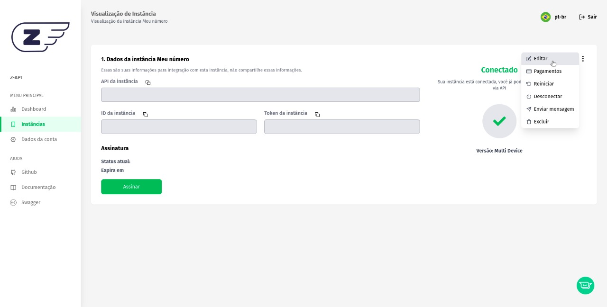

## Concept

In this topic we will talk about the **RETURNS** of the webhooks we use.

Z-API instances make requests with the POST method of the events performed by it to the previously configured URL. For each request there is a specific JSON body that will be described next.

:::caution Important

Your endpoint needs to accept a **POST**

These endpoints are for changing the URL that the instance will call when the event happens.

:::

## What is it and what is it used for?

According to Google, a Webhook is a resource used on the internet for one application to communicate with another, providing real-time data whenever an event happens. This way, the two systems exchange information without any external action being necessary.

If you are integrating with Z-API and need to receive information via Whatsapp, it is necessary to provide these endpoints in your application so that we can notify you about everything that happens on your WhatsApp. That is, every time the connected number receives an interaction, we will make a request with the POST method to the previously configured URL. (For each request there is a specific JSON body)

---

### Our webhooks

#### Delivery 

Responsible for notifying you that your message has been delivered to Whatsapp. However this does not necessarily mean that your contact has received it. For reading and receiving information you will need to look at the webhook’s status.

#### Receive

This webhook will be called every time someone interacts with your number on whatsapp.

#### Status

This method will notify you of all status changes that your message undergoes, if it is received, read, replied to or deleted. The same message can go through several statuses, and have the same status more than once, which is the answered case.

#### Disconnected

This webhook will be called whenever our service identifies any communication unavailability, whether from your cell phone with whatsapp or even the connection between your cell phone and the Z-API.

---

:::tip Tip

- Be sure to read our tips section, there you will find some topics on how to improve your connection with Z-API and have more quality of service.

- You don't need to configure all webhooks, but the more control you have over your instance, the more you will be able to extract resources and develop business with Z-API

:::

## How do I configure my webhook?

:::important

Never share your ID and token with anyone.

:::

Acesse nosso painel admin, vá em opções e escolha "editar instância".

Access our admin panel, go to options and choose "edit instance"

