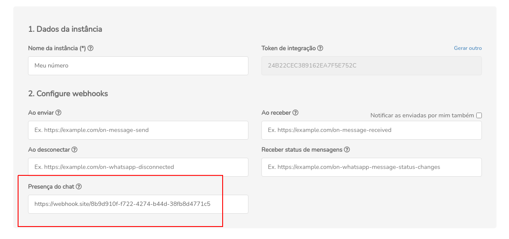

## Concept

This is the chat status return webhook

:::caution Attention

Z-API does not accept webhooks that aren’t HTTPS

:::

---

## Updating the webhook

To update the webhook route, you can do it through the API or through the admin panel.

:::tip Tip

You can change all webhooks at once to the same value using [this endpoint](./update-every-webhooks.md).

:::

### API

#### /update-webhook-chat-presence

`PUT` https://api.z-api.io/instances/YOUR_INSTANCE/token/YOUR_TOKEN/update-webhook-chat-presence

### Header

|      Key       |            Value            |
| :------------: |     :-----------------:     |
|  Client-Token  | **[ACCOUNT SECURITY TOKEN](../security/client-token)** |

---

#### Request Body

```json
{
  "value": "https://endereco-do-seu-sistema.com.br/instancia/SUA_INSTANCIA/presence"
}
```

---

###  Administrative panel



---

## Webhook’s returns 

The possible returns of the **on-chat-presence** webhook are registered below:

## Response

| Attributes| Type| Description |
| :-- | :-: | :-- |
| type | string | Instance event type, in this case it will be "PresenceChatCallback". |
| phone | string | Message destination phone number.|
| status | string | Chat status identifier eg (typing...) status can contain ( UNAVAILABLE, AVAILABLE, COMPOSING, RECORDING) |
| lastSeen | timestamp | User's last present time identifier. |

---

### 200

### Outside of the chat 

```json
{
  "type": "PresenceChatCallback",
  "phone": "5544999999999",
  "status": "UNAVAILABLE",
  "lastSeen": null,
  "instanceId": "instance.id"
}
```

### Inside the chat

```json
{
  "type": "PresenceChatCallback",
  "phone": "5544999999999",
  "status": "AVAILABLE",
  "lastSeen": null,
  "instanceId": "instance.id"
}
```

### Typing in chat

```json
{
  "type": "PresenceChatCallback",
  "phone": "5544999999999",
  "status": "COMPOSING",
  "lastSeen": null,
  "instanceId": "instance.id"
}
```

### Stopped typing or deleted what you were typing 

```json
{
  "type": "PresenceChatCallback",
  "phone": "5544999999999",
  "status": "PAUSED",
  "lastSeen": null,
  "instanceId": "instance.id"
}
```

:::tip Notice

**Observation:**

After receiving a composing or recording, a **PAUSED** will be returned when the event stops

status **PAUSED** is only returned if using beta multi-devices

:::

### Recording audio in chat

```json
{
  "type": "PresenceChatCallback",
  "phone": "5544999999999",
  "status": "RECORDING",
  "lastSeen": null,
  "instanceId": "instance.id"
}
```

:::tip Notice

The status **RECORDING** is only returned if using beta multi-devices

:::

### 405

In this case certify that you are sending the correct specification of the method. This means, verify if you sent a POST or PUT as specified at the beginning of this topic.

### 415

In case you receive 415 error, make sure to add the “Content-Type” of the object you are sending in the request headers, mostly “application/json”

<!-- ---

## Code

<iframe src="//api.apiembed.com/?source=https://raw.githubusercontent.com/Z-API/z-api-docs/main/json-examples/on-chat-presence.json&targets=all" frameborder="0" scrolling="no" width="100%" height="500px" seamless></iframe> -->
