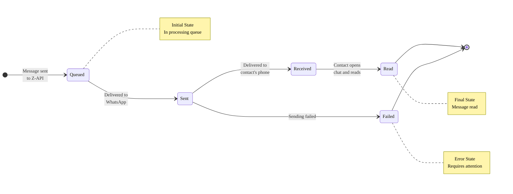

import Tabs from '@theme/Tabs';
import TabItem from '@theme/TabItem';

# Webhook: Message Status

Knowing what happened to a message *after* you sent it is as important as sending it itself. This webhook notifies your system about each step of the message lifecycle, allowing you to create more robust and intelligent automations.

It is triggered for **messages you send**, informing you whether they were queued, sent, delivered, read, or if they failed.

---

## When is this webhook called? {#quando-este-webhook-e-chamado}

The `MessageStatusCallback` event is triggered **every time the status of a message you sent changes**:

- When the message is **sent** (`SENT`)
- When the message is **received** (`RECEIVED`)
- When the message is **read** (`READ`)
- When the message is **read by you** (`READ_BY_ME`)
- When the audio message is **played** (`PLAYED`)

> > A single message can generate **multiple status events** as it progresses through its lifecycle. For example, a message can generate events in the following order: `SENT` → `RECEIVED` → `READ`. Always use the message `id` to track and update the correct status in your system.

---

## Why Track Message Status?

- **Reliability:** Confirm that your important messages (like verification codes or invoices) were actually **delivered** to the recipient.
- **Automation Intelligence:** Create flows that react to user behavior. For example, if a promotional message was **read** but the customer didn't click the link, you can schedule a reminder for the next day.
- **Failure Monitoring:** Be notified immediately if a message **fails**, allowing you to attempt a resend or alert your support team.

---

## The Lifecycle of a Message

A message you send goes through several stages. The status webhook will notify you at each step.



---

## For No-Code Users

In your automation tool, you can create workflows that use the message status as a trigger or as a condition.

**Example reminder flow:**

1. **Trigger (Webhook):** A trigger listens for `message-status` events.
2. **"IF" Node (Conditional):**
   - **If** the `status` field equals `failed`,
   - **Then** send a notification to your support team on Slack or Discord.
3. **Another "IF" Node:**
   - **If** the `status` field equals `read`,
   - **Then** update a field in your CRM or spreadsheet to "Engaged Contact".

---

## For Developers

The triggered event is `MessageStatusCallback`. The payload will contain the `id` of the original message you sent, allowing you to track it in your system.

### Payload Structure

```json
{
  "instanceId": "instance.id",
  "status": "SENT",
  "ids": ["999999999999999999999"],
  "momment": 1632234645000,
  "phoneDevice": 0,
  "phone": "5544999999999",
  "type": "MessageStatusCallback",
  "isGroup": false
}

{
  "instanceId": "instance.id",
  "status": "RECEIVED",
  "ids": ["999999999999999999999"],
  "momment": 1632234655000,
  "phoneDevice": 0,
  "phone": "5544999999999",
  "type": "MessageStatusCallback",
  "isGroup": false
}

{
  "instanceId": "instance.id",
  "status": "READ",
  "ids": ["999999999999999999999"],
  "momment": 1632234665000,
  "phoneDevice": 0,
  "phone": "5544999999999",
  "type": "MessageStatusCallback",
  "isGroup": false
}

{
  "instanceId": "instance.id",
  "status": "PLAYED",
  "ids": ["999999999999999999999"],
  "momment": 1632234675000,
  "phoneDevice": 0,
  "phone": "5544999999999",
  "type": "MessageStatusCallback",
  "isGroup": false
}

{
  "instanceId": "instance.id",
  "status": "READ_BY_ME",
  "ids": ["999999999999999999999"],
  "momment": 1632234685000,
  "phoneDevice": 0,
  "phone": "5544999999999",
  "type": "MessageStatusCallback",
  "isGroup": false
}
```

#### Attributes

| Attributes | Type | Description |
|:---------- |:----- |:----------------------------------------------------------------------------------------------------------- |
| `status` | string | Message status (SENT - if sent, RECEIVED - if received, READ - if read, READ_BY_ME - if read by you (the number connected in your instance), PLAYED - if played) |
| `ids` | array | List of message identifier(s). |
| `momment` | integer | Moment when the instance was disconnected from the number. (Note: Although the official description mentions disconnection, in this context it represents the event timestamp). |
| `phoneDevice` | integer | Indicates the device where the event occurred (0 - Mobile). |
| `phone` | string | Destination phone number of the message. |
| `type` | string | Instance event type, in this case it will be "MessageStatusCallback". |
| `isGroup` | boolean | Indicates whether the chat is a group. |
| `instanceId` | string | Instance identifier. |

---

## Code Examples

<Tabs>
<TabItem value="javascript" label="JavaScript (Fetch)" default>

```javascript
// ⚠️ SECURITY: Use environment variables for credentials
// Never commit tokens in source code
const webhookToken = process.env.ZAPI_WEBHOOK_TOKEN || 'YOUR_SECURITY_TOKEN';

// Input validation (security)
function validateWebhookPayload(payload) {
  if (!payload || typeof payload !== 'object') {
    throw new Error('Invalid payload');
  }
  if (!payload.type || typeof payload.type !== 'string') {
    throw new Error('Invalid event type');
  }
  return true;
}

function validateMessageId(messageId) {
  if (!messageId || typeof messageId !== 'string' || messageId.trim().length === 0) {
    throw new Error('Invalid messageId');
  }
  return messageId.trim();
}

function validateStatus(status) {
  const validStatuses = ['SENT', 'RECEIVED', 'READ', 'READ_BY_ME', 'PLAYED'];
  if (!validStatuses.includes(status)) {
    throw new Error(`Invalid status. Valid values: ${validStatuses.join(', ')}`);
  }
  return status;
}

// Process status webhook
async function handleStatusWebhook(request) {
  try {
    // ⚠️ SECURITY: Validate webhook token
    const receivedToken = request.headers.get('x-token');
    if (receivedToken !== webhookToken) {
      return new Response('Unauthorized', { status: 401 });
    }

    const payload = await request.json();
    validateWebhookPayload(payload);

    if (payload.type === 'MessageStatusCallback') {
      // The ids field is an array, we take the first ID for simplicity
      const messageId = payload.ids && payload.ids.length > 0 ? validateMessageId(payload.ids[0]) : null;
      const status = validateStatus(payload.status);
      const phone = payload.phone;
      const momment = payload.momment;

      if (!messageId) {
        console.warn('Webhook received without valid messageId');
        return new Response(JSON.stringify({ status: 'Ignored' }), { status: 200 });
      }

      // ⚠️ SECURITY: Do not log sensitive data
      console.log(`Message ${messageId} status updated to: ${status}`);

      // Update status in database (example)
      // In production, use an ORM like Prisma or Sequelize
      await updateMessageStatus(messageId, status, phone, momment);

      // Logic based on status
      switch (status) {
        case 'READ':
          console.log('Message was read by recipient');
          // Implement engagement logic
          break;
        case 'RECEIVED':
          console.log('Message was delivered to recipient');
          break;
      }
    }

    // Always respond quickly to not block Z-API
    return new Response(JSON.stringify({ status: 'OK' }), {
      status: 200,
      headers: { 'Content-Type': 'application/json' },
    });
  } catch (error) {
    // ⚠️ SECURITY: Generic error handling
    console.error('Error processing webhook:', error.message);
    return new Response(JSON.stringify({ error: 'Error processing webhook' }), {
      status: 500,
      headers: { 'Content-Type': 'application/json' },
    });
  }
}

// Helper function to update status (example)
async function updateMessageStatus(messageId, status, phone, momment) {
  // In production, replace with actual database call
  // Example: await db.messages.update({ where: { id: messageId }, data: { status } });
  console.log(`Updating message ${messageId} to status ${status}`);
}

// Usage example (Cloudflare Workers, Vercel, etc.)
export default {
  async fetch(request) {
    if (request.method === 'POST' && request.url.endsWith('/webhook')) {
      return handleStatusWebhook(request);
    }
    return new Response('Not Found', { status: 404 });
  },
};
```

</TabItem>
<TabItem value="typescript" label="TypeScript">

```typescript
// Types for better type safety
type MessageStatus = 'SENT' | 'RECEIVED' | 'READ' | 'READ_BY_ME' | 'PLAYED';

interface StatusWebhookPayload {
  instanceId: string;
  status: MessageStatus;
  ids: string[];
  momment: number;
  phoneDevice: number;
  phone: string;
  type: 'MessageStatusCallback';
  isGroup: boolean;
}

// ⚠️ SECURITY: Use environment variables for credentials
const webhookToken: string = process.env.ZAPI_WEBHOOK_TOKEN || 'YOUR_SECURITY_TOKEN';

// Input validation (security)
function validateMessageId(messageId: string): string {
  if (!messageId || messageId.trim().length === 0) {
    throw new Error('Invalid messageId');
  }
  return messageId.trim();
}

function validateStatus(status: string): MessageStatus {
  const validStatuses: MessageStatus[] = ['SENT', 'RECEIVED', 'READ', 'READ_BY_ME', 'PLAYED'];
  if (!validStatuses.includes(status as MessageStatus)) {
    throw new Error(`Invalid status. Valid values: ${validStatuses.join(', ')}`);
  }
  return status as MessageStatus;
}

// Process status webhook
async function handleStatusWebhook(request: Request): Promise<Response> {
  try {
    // ⚠️ SECURITY: Validate webhook token
    const receivedToken = request.headers.get('x-token');
    if (receivedToken !== webhookToken) {
      return new Response('Unauthorized', { status: 401 });
    }

    const payload: StatusWebhookPayload = await request.json();

    if (payload.type === 'MessageStatusCallback') {
      const messageId = payload.ids && payload.ids.length > 0 ? validateMessageId(payload.ids[0]) : '';
      const status = validateStatus(payload.status);

      if (!messageId) {
        console.warn('Webhook without valid ID');
        return new Response(JSON.stringify({ status: 'Ignored' }), { status: 200 });
      }

      console.log(`Message ${messageId} status updated to: ${status}`);

      // Update status in database
      await updateMessageStatus(messageId, status, payload.phone, payload.momment);
    }

    return new Response(JSON.stringify({ status: 'OK' }), {
      status: 200,
      headers: { 'Content-Type': 'application/json' },
    });
  } catch (error) {
    console.error('Error processing webhook:', error instanceof Error ? error.message : 'Unknown error');
    return new Response(JSON.stringify({ error: 'Error processing webhook' }), {
      status: 500,
      headers: { 'Content-Type': 'application/json' },
    });
  }
}

// Helper function to update status
async function updateMessageStatus(
  messageId: string,
  status: MessageStatus,
  phone: string,
  momment: number
): Promise<void> {
  // In production, replace with actual database call
  console.log(`Updating message ${messageId} to status ${status}`);
}
```

</TabItem>
<TabItem value="python" label="Python (Requests)">

```python
import os
from flask import Flask, request, jsonify
from typing import Dict, Any, Literal

# ⚠️ SECURITY: Use environment variables for credentials
webhook_token = os.getenv('ZAPI_WEBHOOK_TOKEN', 'YOUR_SECURITY_TOKEN')

app = Flask(__name__)

# Input validation (security)
def validate_message_id(message_id: str) -> str:
    if not message_id or not isinstance(message_id, str) or not message_id.strip():
        raise ValueError('Invalid messageId')
    return message_id.strip()

def validate_status(status: str) -> Literal['SENT', 'RECEIVED', 'READ', 'READ_BY_ME', 'PLAYED']:
    valid_statuses = ['SENT', 'RECEIVED', 'READ', 'READ_BY_ME', 'PLAYED']
    if status not in valid_statuses:
        raise ValueError(f'Invalid status. Valid values: {", ".join(valid_statuses)}')
    return status  # type: ignore

@app.route('/webhook', methods=['POST'])
def webhook():
    try:
        # ⚠️ SECURITY: Validate webhook token
        received_token = request.headers.get('x-token')
        if received_token != webhook_token:
            return jsonify({'error': 'Unauthorized'}), 401

        payload = request.json
        if not payload or payload.get('type') != 'MessageStatusCallback':
            return jsonify({'error': 'Invalid event'}), 400

        # Handle list of IDs
        ids = payload.get('ids', [])
        message_id = validate_message_id(ids[0] if ids else None)
        
        status = validate_status(payload.get('status'))
        phone = payload.get('phone')
        momment = payload.get('momment')

        # ⚠️ SECURITY: Do not log sensitive data
        print(f'Message {message_id} status updated to: {status}')

        # Update status in database
        update_message_status(message_id, status, phone, momment)

        # Logic based on status
        if status == 'READ':
            print('Message was read by recipient')
        elif status == 'RECEIVED':
            print('Message failed to send')

        # Always respond quickly to not block Z-API
        return jsonify({'status': 'OK'}), 200
    except Exception as e:
        # ⚠️ SECURITY: Generic error handling
        print(f'Error processing webhook: {str(e)}')
        return jsonify({'error': 'Error processing webhook'}), 500

def update_message_status(message_id: str, status: str, phone: str, momment: int):
    # In production, replace with actual database call
    print(f'Updating message {message_id} to status {status}')

if __name__ == '__main__':
    app.run(port=3000)
```

</TabItem>
<TabItem value="curl" label="cURL">

```bash
# ⚠️ SECURITY: Use environment variables for credentials
# Configure via: export ZAPI_WEBHOOK_TOKEN="your-token"
WEBHOOK_TOKEN="${ZAPI_WEBHOOK_TOKEN:-YOUR_SECURITY_TOKEN}"

# Example webhook test (simulating Z-API request)
# ⚠️ SECURITY: Always use HTTPS (never HTTP)
curl -X POST "https://your-server.com/webhook" \
  -H "Content-Type: application/json" \
  -H "x-token: ${WEBHOOK_TOKEN}" \
  -d '{
    "type": "MessageStatusCallback",
    "instanceId": "instance.id",
    "ids": ["3EB0C767F26A"],
    "status": "READ",
    "phone": "5511999999999",
    "momment": 1632234645000,
    "phoneDevice": 0,
    "isGroup": false
  }' \
  --fail-with-body \
  --max-time 30

# ⚠️ SECURITY: Clean sensitive variables after use (optional)
unset WEBHOOK_TOKEN
```

</TabItem>
<TabItem value="nodejs" label="Node.js (Native HTTPS)">

```javascript
const http = require('http');
const crypto = require('crypto');

// ⚠️ SECURITY: Use environment variables for credentials
const webhookToken = process.env.ZAPI_WEBHOOK_TOKEN || 'YOUR_SECURITY_TOKEN';

// Input validation (security)
function validateMessageId(messageId) {
  if (!messageId || typeof messageId !== 'string' || messageId.trim().length === 0) {
    throw new Error('Invalid messageId');
  }
  return messageId.trim();
}

function validateStatus(status) {
  const validStatuses = ['SENT', 'RECEIVED', 'READ', 'READ_BY_ME', 'PLAYED'];
  if (!validStatuses.includes(status)) {
    throw new Error(`Invalid status. Valid values: ${validStatuses.join(', ')}`);
  }
  return status;
}

// Helper function to update status (example)
function updateMessageStatus(messageId, status, phone, momment) {
  // In production, replace with actual database call
  // Example: await db.messages.update({ where: { id: messageId }, data: { status } });
  console.log(`Updating message ${messageId} to status ${status}`);
}

const server = http.createServer((req, res) => {
  if (req.method === 'POST' && req.url === '/webhook') {
    let body = '';

    req.on('data', (chunk) => {
      body += chunk.toString();
    });

    req.on('end', () => {
      try {
        // ⚠️ SECURITY: Validate webhook token (using timing-safe comparison)
        const providedToken = req.headers['x-token'];
        if (!providedToken || !crypto.timingSafeEqual(
          Buffer.from(providedToken),
          Buffer.from(webhookToken)
        )) {
          res.writeHead(401, { 'Content-Type': 'application/json' });
          res.end(JSON.stringify({ error: 'Unauthorized' }));
          return;
        }

        const payload = JSON.parse(body);

        if (payload.type === 'MessageStatusCallback') {
          const messageId = payload.ids && payload.ids.length > 0 ? validateMessageId(payload.ids[0]) : null;
          const status = validateStatus(payload.status);
          const phone = payload.phone;
          const momment = payload.momment;

          if (messageId) {
            // ⚠️ SECURITY: Do not log sensitive data
            console.log(`Message ${messageId} status updated to: ${status}`);

            // Update status in database
            updateMessageStatus(messageId, status, phone, momment);
          }

          // Logic based on status
          switch (status) {
            case 'READ':
              console.log('Message was read by recipient');
              break;
            case 'PLAYED':
              console.log('Audio played');
              break;
          }
        }

        // Always respond quickly to not block Z-API
        res.writeHead(200, { 'Content-Type': 'application/json' });
        res.end(JSON.stringify({ status: 'OK' }));
      } catch (error) {
        // ⚠️ SECURITY: Generic error handling
        console.error('Error processing webhook:', error.message);
        res.writeHead(500, { 'Content-Type': 'application/json' });
        res.end(JSON.stringify({ error: 'Error processing webhook' }));
      }
    });
  } else {
    res.writeHead(404, { 'Content-Type': 'application/json' });
    res.end(JSON.stringify({ error: 'Not Found' }));
  }
});

server.listen(3000, () => {
  console.log('Webhook server running on port 3000');
});
```

</TabItem>
<TabItem value="nodejs-express" label="Node.js (Express)">

```javascript
const express = require('express');
const app = express();

app.use(express.json());

// ⚠️ SECURITY: Use environment variables for credentials
const webhookToken = process.env.ZAPI_WEBHOOK_TOKEN || 'YOUR_SECURITY_TOKEN';

// Input validation (security)
function validateMessageId(messageId) {
  if (!messageId || typeof messageId !== 'string' || messageId.trim().length === 0) {
    throw new Error('Invalid messageId');
  }
  return messageId.trim();
}

function validateStatus(status) {
  const validStatuses = ['SENT', 'RECEIVED', 'READ', 'READ_BY_ME', 'PLAYED'];
  if (!validStatuses.includes(status)) {
    throw new Error(`Invalid status. Valid values: ${validStatuses.join(', ')}`);
  }
  return status;
}

app.post('/webhook', (req, res) => {
  try {
    // ⚠️ SECURITY: Validate webhook token
    const receivedToken = req.headers['x-token'];
    if (receivedToken !== webhookToken) {
      return res.status(401).json({ error: 'Unauthorized' });
    }

    const payload = req.body;

    if (payload.type === 'MessageStatusCallback') {
      const messageId = payload.ids && payload.ids.length > 0 ? validateMessageId(payload.ids[0]) : null;
      const status = validateStatus(payload.status);
      const phone = payload.phone;
      const momment = payload.momment;

      if (messageId) {
        // ⚠️ SECURITY: Do not log sensitive data
        console.log(`Message ${messageId} status updated to: ${status}`);

        // Update status in database
        updateMessageStatus(messageId, status, phone, momment);
      }
    }

    // Always respond quickly to not block Z-API
    res.status(200).json({ status: 'OK' });
  } catch (error) {
    // ⚠️ SECURITY: Generic error handling
    console.error('Error processing webhook:', error.message);
    res.status(500).json({ error: 'Error processing webhook' });
  }
});

// Helper function to update status (example)
function updateMessageStatus(messageId, status, phone, momment) {
  // In production, replace with actual database call
  // Example: await db.messages.update({ where: { id: messageId }, data: { status } });
  console.log(`Updating message ${messageId} to status ${status}`);
}

app.listen(3000, () => {
  console.log('Webhook server running on port 3000');
});
```

</TabItem>
<TabItem value="nodejs-koa" label="Node.js (Koa)">

```javascript
const Koa = require('koa');
const Router = require('@koa/router');

const app = new Koa();
const router = new Router();

// ⚠️ SECURITY: Use environment variables for credentials
const webhookToken = process.env.ZAPI_WEBHOOK_TOKEN || 'YOUR_SECURITY_TOKEN';

// Middleware for JSON parsing
app.use(require('koa-bodyparser')());

// Input validation (security)
function validateMessageId(messageId) {
  if (!messageId || typeof messageId !== 'string' || messageId.trim().length === 0) {
    throw new Error('Invalid messageId');
  }
  return messageId.trim();
}

function validateStatus(status) {
  const validStatuses = ['SENT', 'RECEIVED', 'READ', 'READ_BY_ME', 'PLAYED'];
  if (!validStatuses.includes(status)) {
    throw new Error(`Invalid status. Valid values: ${validStatuses.join(', ')}`);
  }
  return status;
}

// Route to receive webhook
router.post('/webhook', async (ctx) => {
  try {
    // ⚠️ SECURITY: Validate webhook token
    const receivedToken = ctx.request.headers['x-token'];
    if (receivedToken !== webhookToken) {
      ctx.status = 401;
      ctx.body = { error: 'Unauthorized' };
      return;
    }

    const payload = ctx.request.body;

    if (payload.type === 'MessageStatusCallback') {
      const messageId = payload.ids && payload.ids.length > 0 ? validateMessageId(payload.ids[0]) : null;
      const status = validateStatus(payload.status);
      const phone = payload.phone;
      const momment = payload.momment;

      if (messageId) {
        console.log(`Message ${messageId} status updated to: ${status}`);
        updateMessageStatus(messageId, status, phone, momment);
      }
    }

    // Always respond quickly to not block Z-API
    ctx.status = 200;
    ctx.body = { status: 'OK' };
  } catch (error) {
    // ⚠️ SECURITY: Generic error handling
    ctx.app.emit('error', error, ctx);
    ctx.status = 500;
    ctx.body = { error: 'Error processing webhook' };
  }
});

// Helper function to update status (example)
function updateMessageStatus(messageId, status, phone, momment) {
  // In production, replace with actual database call
  // Example: await db.messages.update({ where: { id: messageId }, data: { status } });
  console.log(`Updating message ${messageId} to status ${status}`);
}

app.use(router.routes());
app.use(router.allowedMethods());

// Error handler
app.on('error', (err, ctx) => {
  console.error('Error processing webhook:', err.message);
});

app.listen(3000, () => {
  console.log('Webhook server running on port 3000');
});
```

</TabItem>
<TabItem value="java" label="Java">

```java
import com.sun.net.httpserver.HttpServer;
import com.sun.net.httpserver.HttpHandler;
import com.sun.net.httpserver.HttpExchange;
import java.io.*;
import java.net.InetSocketAddress;
import java.nio.charset.StandardCharsets;
import java.util.Arrays;
import java.util.List;
import com.google.gson.Gson;
import com.google.gson.JsonObject;
import com.google.gson.JsonArray;

// ⚠️ SECURITY: Use environment variables for credentials
class StatusWebhookHandler implements HttpHandler {
    private static final String WEBHOOK_TOKEN = System.getenv("ZAPI_WEBHOOK_TOKEN") != null 
        ? System.getenv("ZAPI_WEBHOOK_TOKEN") : "YOUR_SECURITY_TOKEN";
    private static final Gson gson = new Gson();
    private static final List<String> VALID_STATUSES = Arrays.asList(
        "SENT", "RECEIVED", "READ", "READ_BY_ME", "PLAYED"
    );

    // Input validation (security)
    private String validateMessageId(String messageId) {
        if (messageId == null || messageId.trim().isEmpty()) {
            throw new IllegalArgumentException("Invalid messageId");
        }
        return messageId.trim();
    }

    private String validateStatus(String status) {
        if (!VALID_STATUSES.contains(status)) {
            throw new IllegalArgumentException(
                "Invalid status. Valid values: " + String.join(", ", VALID_STATUSES)
            );
        }
        return status;
    }

    @Override
    public void handle(HttpExchange exchange) throws IOException {
        if (!"POST".equals(exchange.getRequestMethod())) {
            sendResponse(exchange, 405, "{\"error\":\"Method not allowed\"}");
            return;
        }

        try {
            // ⚠️ SECURITY: Validate webhook token
            String receivedToken = exchange.getRequestHeaders().getFirst("x-token");
            if (receivedToken == null || !receivedToken.equals(WEBHOOK_TOKEN)) {
                sendResponse(exchange, 401, "{\"error\":\"Unauthorized\"}");
                return;
            }

            // Read payload
            String requestBody = new String(exchange.getRequestBody().readAllBytes(), StandardCharsets.UTF_8);
            JsonObject payload = gson.fromJson(requestBody, JsonObject.class);
            
            // Check event type
             if (payload.has("type") && "MessageStatusCallback".equals(payload.get("type").getAsString())) {
                JsonArray ids = payload.getAsJsonArray("ids");
                String messageId = (ids != null && ids.size() > 0) ? validateMessageId(ids.get(0).getAsString()) : null;
                
                String status = validateStatus(payload.get("status").getAsString());
                String phone = payload.get("phone").getAsString();
                long momment = payload.get("momment").getAsLong();

                if (messageId != null) {
                    System.out.println("Message " + messageId + " status updated to: " + status);
                    updateMessageStatus(messageId, status, phone, momment);
                }

                // Logic based on status
                switch (status) {
                    case "READ":
                        System.out.println("Message was read by recipient");
                        break;
                    case "PLAYED":
                        System.out.println("Audio played");
                        break;
                }
            }

            // Always respond quickly to not block Z-API
            sendResponse(exchange, 200, "{\"status\":\"OK\"}");
        } catch (Exception e) {
            System.err.println("Error processing webhook: " + e.getMessage());
            sendResponse(exchange, 500, "{\"error\":\"Error processing webhook\"}");
        }
    }

    private void updateMessageStatus(String messageId, String status, String phone, long momment) {
        // In production, replace with actual database call
        System.out.println("Updating message " + messageId + " to status " + status);
    }

    private void sendResponse(HttpExchange exchange, int statusCode, String response) throws IOException {
        exchange.getResponseHeaders().set("Content-Type", "application/json");
        exchange.sendResponseHeaders(statusCode, response.getBytes().length);
        try (OutputStream os = exchange.getResponseBody()) {
            os.write(response.getBytes());
        }
    }
}

public class WebhookServer {
    public static void main(String[] args) throws IOException {
        HttpServer server = HttpServer.create(new InetSocketAddress(3000), 0);
        server.createContext("/webhook", new StatusWebhookHandler());
        server.setExecutor(null);
        server.start();
        System.out.println("Webhook server running on port 3000");
    }
}
```

</TabItem>
<TabItem value="csharp" label="C#">

```csharp
using System;
using System.IO;
using System.Net;
using System.Text;
using System.Threading.Tasks;
using Newtonsoft.Json;
using Newtonsoft.Json.Linq;

// ⚠️ SECURITY: Use environment variables for credentials
public class StatusWebhookHandler
{
    private static readonly string WebhookToken = Environment.GetEnvironmentVariable("ZAPI_WEBHOOK_TOKEN") 
        ?? "YOUR_SECURITY_TOKEN";
    private static readonly string[] ValidStatuses = { "queued", "sent", "received", "read", "failed" };

    // Input validation (security)
    private static string ValidateMessageId(string messageId)
    {
        if (string.IsNullOrWhiteSpace(messageId))
        {
            throw new ArgumentException("Invalid messageId");
        }
        return messageId.Trim();
    }

    private static string ValidateStatus(string status)
    {
        if (!Array.Exists(ValidStatuses, s => s == status))
        {
            throw new ArgumentException($"Invalid status. Valid values: {string.Join(", ", ValidStatuses)}");
        }
        return status;
    }

    public static async Task HandleRequest(HttpListenerContext context)
    {
        var request = context.Request;
        var response = context.Response;

        if (request.HttpMethod != "POST")
        {
            SendResponse(response, 405, "{\"error\":\"Method not allowed\"}");
            return;
        }

        try
        {
            // ⚠️ SECURITY: Validate webhook token
            string receivedToken = request.Headers["x-token"];
            if (string.IsNullOrEmpty(receivedToken) || receivedToken != WebhookToken)
            {
                SendResponse(response, 401, "{\"error\":\"Unauthorized\"}");
                return;
            }

            // Read payload
            string requestBody;
            using (var reader = new StreamReader(request.InputStream, Encoding.UTF8))
            {
                requestBody = await reader.ReadToEndAsync();
            }

            JObject payload = JObject.Parse(requestBody);
            string eventType = payload["event"].ToString();
            JObject data = payload["data"] as JObject;

            if (eventType == "message-status" && data != null)
            {
                string messageId = ValidateMessageId(data["messageId"].ToString());
                string status = ValidateStatus(data["status"].ToString());
                string phone = data["phone"].ToString();
                long timestamp = data["timestamp"].Value<long>();

                Console.WriteLine($"Message {messageId} status updated to: {status}");

                // Update status in database
                UpdateMessageStatus(messageId, status, phone, timestamp);

                // Logic based on status
                switch (status)
                {
                    case "read":
                        Console.WriteLine("Message was read by recipient");
                        break;
                    case "failed":
                        Console.WriteLine("Message failed to send");
                        break;
                }
            }

            // Always respond quickly to not block Z-API
            SendResponse(response, 200, "{\"status\":\"OK\"}");
        }
        catch (Exception ex)
        {
            Console.Error.WriteLine($"Error processing webhook: {ex.Message}");
            SendResponse(response, 500, "{\"error\":\"Error processing webhook\"}");
        }
    }

    private static void UpdateMessageStatus(string messageId, string status, string phone, long timestamp)
    {
        // In production, replace with actual database call
        Console.WriteLine($"Updating message {messageId} to status {status}");
    }

    private static void SendResponse(HttpListenerResponse response, int statusCode, string body)
    {
        response.StatusCode = statusCode;
        response.ContentType = "application/json";
        byte[] buffer = Encoding.UTF8.GetBytes(body);
        response.ContentLength64 = buffer.Length;
        response.OutputStream.Write(buffer, 0, buffer.Length);
        response.Close();
    }
}

// Example usage with HttpListener
class Program
{
    static void Main()
    {
        HttpListener listener = new HttpListener();
        listener.Prefixes.Add("http://localhost:3000/webhook/");
        listener.Start();
        Console.WriteLine("Webhook server running on port 3000");

        while (true)
        {
            HttpListenerContext context = listener.GetContext();
            Task.Run(() => StatusWebhookHandler.HandleRequest(context));
        }
    }
}
```

</TabItem>
<TabItem value="go" label="Go">

```go
package main

import (
    "encoding/json"
    "fmt"
    "io"
    "net/http"
    "os"
    "strings"
)

// ⚠️ SECURITY: Use environment variables for credentials
var webhookToken = getEnv("ZAPI_WEBHOOK_TOKEN", "YOUR_SECURITY_TOKEN")

func getEnv(key, defaultValue string) string {
    if value := os.Getenv(key); value != "" {
        return value
    }
    return defaultValue
}

// Payload structure
type StatusWebhookPayload struct {
    Event      string `json:"event"`
    InstanceID string `json:"instanceId"`
    Data       struct {
        MessageID string `json:"messageId"`
        Phone     string `json:"phone"`
        Status    string `json:"status"`
        Timestamp int64  `json:"timestamp"`
    } `json:"data"`
}

// Input validation (security)
func validateMessageID(messageID string) (string, error) {
    trimmed := strings.TrimSpace(messageID)
    if trimmed == "" {
        return "", fmt.Errorf("invalid messageId")
    }
    return trimmed, nil
}

func validateStatus(status string) (string, error) {
    validStatuses := []string{"queued", "sent", "received", "read", "failed"}
    for _, validStatus := range validStatuses {
        if status == validStatus {
            return status, nil
        }
    }
    return "", fmt.Errorf("invalid status. Valid values: %s", strings.Join(validStatuses, ", "))
}

func updateMessageStatus(messageID, status, phone string, timestamp int64) {
    // In production, replace with actual database call
    fmt.Printf("Updating message %s to status %s\n", messageID, status)
}

func webhookHandler(w http.ResponseWriter, r *http.Request) {
    if r.Method != http.MethodPost {
        http.Error(w, "Method not allowed", http.StatusMethodNotAllowed)
        return
    }

    // ⚠️ SECURITY: Validate webhook token
    receivedToken := r.Header.Get("x-token")
    if receivedToken != webhookToken {
        http.Error(w, "Unauthorized", http.StatusUnauthorized)
        return
    }

    body, err := io.ReadAll(r.Body)
    if err != nil {
        http.Error(w, "Error reading payload", http.StatusBadRequest)
        return
    }
    defer r.Body.Close()

    var payload StatusWebhookPayload
    if err := json.Unmarshal(body, &payload); err != nil {
        http.Error(w, "Error processing JSON", http.StatusBadRequest)
        return
    }

    if payload.Event == "message-status" && payload.Data.MessageID != "" {
        messageID, err := validateMessageID(payload.Data.MessageID)
        if err != nil {
            http.Error(w, err.Error(), http.StatusBadRequest)
            return
        }

        status, err := validateStatus(payload.Data.Status)
        if err != nil {
            http.Error(w, err.Error(), http.StatusBadRequest)
            return
        }

        fmt.Printf("Message %s status updated to: %s\n", messageID, status)

        // Update status in database
        updateMessageStatus(messageID, status, payload.Data.Phone, payload.Data.Timestamp)

        // Logic based on status
        switch status {
        case "read":
            fmt.Println("Message was read by recipient")
        case "failed":
            fmt.Println("Message failed to send")
        }
    }

    // Always respond quickly to not block Z-API
    w.Header().Set("Content-Type", "application/json")
    w.WriteHeader(http.StatusOK)
    json.NewEncoder(w).Encode(map[string]string{"status": "OK"})
}

func main() {
    http.HandleFunc("/webhook", webhookHandler)
    fmt.Println("Webhook server running on port 3000")
    http.ListenAndServe(":3000", nil)
}
```

</TabItem>
<TabItem value="php" label="PHP">

```php
<?php
// ⚠️ SECURITY: Use environment variables for credentials
$webhookToken = getenv('ZAPI_WEBHOOK_TOKEN') ?: 'YOUR_SECURITY_TOKEN';

// Input validation (security)
function validateMessageId($messageId) {
    if (empty($messageId) || !is_string($messageId) || trim($messageId) === '') {
        throw new Exception('Invalid messageId');
    }
    return trim($messageId);
}

function validateStatus($status) {
    $validStatuses = ['queued', 'sent', 'received', 'read', 'failed'];
    if (!in_array($status, $validStatuses)) {
        throw new Exception('Invalid status. Valid values: ' . implode(', ', $validStatuses));
    }
    return $status;
}

// Process webhook
if ($_SERVER['REQUEST_METHOD'] === 'POST') {
    try {
        // ⚠️ SECURITY: Validate webhook token
        $receivedToken = $_SERVER['HTTP_X_TOKEN'] ?? '';
        if ($receivedToken !== $webhookToken) {
            http_response_code(401);
            echo json_encode(['error' => 'Unauthorized']);
            exit;
        }

        // Read payload
        $payload = json_decode(file_get_contents('php://input'), true);
        
        if (($payload['event'] ?? '') === 'message-status' && !empty($payload['data'])) {
            $data = $payload['data'];
            $messageId = validateMessageId($data['messageId']);
            $status = validateStatus($data['status']);
            $phone = $data['phone'] ?? '';
            $timestamp = $data['timestamp'] ?? 0;

            // ⚠️ SECURITY: Do not log sensitive data
            error_log("Message {$messageId} status updated to: {$status}");

            // Update status in database
            updateMessageStatus($messageId, $status, $phone, $timestamp);

            // Logic based on status
            switch ($status) {
                case 'read':
                    error_log('Message was read by recipient');
                    break;
                case 'failed':
                    error_log('Message failed to send');
                    break;
            }
        }

        // Always respond quickly to not block Z-API
        http_response_code(200);
        header('Content-Type: application/json');
        echo json_encode(['status' => 'OK']);
    } catch (Exception $e) {
        // ⚠️ SECURITY: Generic error handling
        error_log("Error processing webhook: " . $e->getMessage());
        http_response_code(500);
        echo json_encode(['error' => 'Error processing webhook']);
    }
} else {
    http_response_code(405);
    echo json_encode(['error' => 'Method not allowed']);
}

function updateMessageStatus($messageId, $status, $phone, $timestamp) {
    // In production, replace with actual database call
    error_log("Updating message {$messageId} to status {$status}");
}
?>
```

</TabItem>
<TabItem value="ruby" label="Ruby">

```ruby
require 'sinatra'
require 'json'

# ⚠️ SECURITY: Use environment variables for credentials
WEBHOOK_TOKEN = ENV['ZAPI_WEBHOOK_TOKEN'] || 'YOUR_SECURITY_TOKEN'

# Input validation (security)
def validate_message_id(message_id)
  raise ArgumentError, 'Invalid messageId' if message_id.nil? || message_id.to_s.strip.empty?
  message_id.to_s.strip
end

def validate_status(status)
  valid_statuses = ['queued', 'sent', 'received', 'read', 'failed']
  unless valid_statuses.include?(status)
    raise ArgumentError, "Invalid status. Valid values: #{valid_statuses.join(', ')}"
  end
  status
end

def update_message_status(message_id, status, phone, timestamp)
  # In production, replace with actual database call
  puts "Updating message #{message_id} to status #{status}"
end

post '/webhook' do
  begin
    # ⚠️ SECURITY: Validate webhook token
    received_token = request.env['HTTP_X_TOKEN']
    if received_token != WEBHOOK_TOKEN
      status 401
      return { error: 'Unauthorized' }.to_json
    end

    payload = JSON.parse(request.body.read)
    
    if payload['event'] == 'message-status' && payload['data']
      data = payload['data']
      message_id = validate_message_id(data['messageId'])
      status = validate_status(data['status'])
      phone = data['phone']
      timestamp = data['timestamp']

      # ⚠️ SECURITY: Do not log sensitive data
      puts "Message #{message_id} status updated to: #{status}"

      # Update status in database
      update_message_status(message_id, status, phone, timestamp)

      # Logic based on status
      case status
      when 'read'
        puts 'Message was read by recipient'
      when 'failed'
        puts 'Message failed to send'
      end
    end

    # Always respond quickly to not block Z-API
    status 200
    { status: 'OK' }.to_json
  rescue => e
    # ⚠️ SECURITY: Generic error handling
    puts "Error processing webhook: #{e.message}"
    status 500
    { error: 'Error processing webhook' }.to_json
  end
end

# Start server
set :port, 3000
```

</TabItem>
<TabItem value="swift" label="Swift">

```swift
import Foundation
import Vapor

// ⚠️ SECURITY: Use environment variables for credentials
let webhookToken = Environment.get("ZAPI_WEBHOOK_TOKEN") ?? "YOUR_SECURITY_TOKEN"

// Payload structure
struct StatusWebhookPayload: Content {
    let event: String
    let instanceId: String
    let data: StatusData
}

struct StatusData: Content {
    let messageId: String
    let phone: String
    let status: String
    let timestamp: Int64
}

// Input validation (security)
func validateMessageId(_ messageId: String) throws -> String {
    let trimmed = messageId.trimmingCharacters(in: .whitespacesAndNewlines)
    if trimmed.isEmpty {
        throw Abort(.badRequest, reason: "Invalid messageId")
    }
    return trimmed
}

func validateStatus(_ status: String) throws -> String {
    let validStatuses = ["queued", "sent", "received", "read", "failed"]
    guard validStatuses.contains(status) else {
        throw Abort(.badRequest, reason: "Invalid status. Valid values: \(validStatuses.joined(separator: ", "))")
    }
    return status
}

func updateMessageStatus(_ messageId: String, _ status: String, _ phone: String, _ timestamp: Int64, on app: Application) {
    // In production, replace with actual database call
    app.logger.info("Updating message \(messageId) to status \(status)")
}

// Configure route
func configure(_ app: Application) throws {
    app.post("webhook") { req -> EventLoopFuture<Response> in
        // ⚠️ SECURITY: Validate webhook token
        guard let receivedToken = req.headers["x-token"].first,
              receivedToken == webhookToken else {
            throw Abort(.unauthorized, reason: "Invalid security token")
        }

        return req.content.decode(StatusWebhookPayload.self).flatMap { payload in
            if payload.event == "message-status" {
                do {
                    let messageId = try validateMessageId(payload.data.messageId)
                    let status = try validateStatus(payload.data.status)

                    app.logger.info("Message \(messageId) status updated to: \(status)")

                    // Update status in database
                    updateMessageStatus(messageId, status, payload.data.phone, payload.data.timestamp, on: app)

                    // Logic based on status
                    switch status {
                    case "read":
                        app.logger.info("Message was read by recipient")
                    case "failed":
                        app.logger.info("Message failed to send")
                    default:
                        break
                    }
                } catch {
                    app.logger.error("Validation error: \(error)")
                }
            }

            // Always respond quickly to not block Z-API
            return req.eventLoop.makeSucceededFuture(Response(status: .ok, body: .init(string: "{\"status\":\"OK\"}")))
        }
    }
}
```

</TabItem>
<TabItem value="powershell" label="PowerShell">

```powershell
# ⚠️ SECURITY: Use environment variables for credentials
$webhookToken = if ($env:ZAPI_WEBHOOK_TOKEN) { $env:ZAPI_WEBHOOK_TOKEN } else { "YOUR_SECURITY_TOKEN" }

# Input validation (security)
function Validate-MessageId {
    param($messageId)
    if ([string]::IsNullOrWhiteSpace($messageId)) {
        throw "Invalid messageId"
    }
    return $messageId.Trim()
}

function Validate-Status {
    param($status)
    $validStatuses = @('queued', 'sent', 'received', 'read', 'failed')
    if ($validStatuses -notcontains $status) {
        throw "Invalid status. Valid values: $($validStatuses -join ', ')"
    }
    return $status
}

function Update-MessageStatus {
    param($messageId, $status, $phone, $timestamp)
    # In production, replace with actual database call
    Write-Host "Updating message $messageId to status $status"
}

# Create HTTP listener
$listener = New-Object System.Net.HttpListener
$listener.Prefixes.Add("http://localhost:3000/webhook/")
$listener.Start()

Write-Host "Webhook server running on port 3000"

while ($listener.IsListening) {
    $context = $listener.GetContext()
    $request = $context.Request
    $response = $context.Response

    try {
        if ($request.HttpMethod -ne "POST") {
            $response.StatusCode = 405
            $buffer = [System.Text.Encoding]::UTF8.GetBytes('{"error":"Method not allowed"}')
            $response.ContentLength64 = $buffer.Length
            $response.OutputStream.Write($buffer, 0, $buffer.Length)
            $response.Close()
            continue
        }

        # ⚠️ SECURITY: Validate webhook token
        $receivedToken = $request.Headers["x-token"]
        if ($receivedToken -ne $webhookToken) {
            $response.StatusCode = 401
            $buffer = [System.Text.Encoding]::UTF8.GetBytes('{"error":"Unauthorized"}')
            $response.ContentLength64 = $buffer.Length
            $response.OutputStream.Write($buffer, 0, $buffer.Length)
            $response.Close()
            continue
        }

        # Read payload
        $reader = New-Object System.IO.StreamReader($request.InputStream)
        $body = $reader.ReadToEnd()
        $payload = $body | ConvertFrom-Json

        if ($payload.event -eq "message-status" -and $payload.data) {
            $messageId = Validate-MessageId -messageId $payload.data.messageId
            $status = Validate-Status -status $payload.data.status
            $phone = $payload.data.phone
            $timestamp = $payload.data.timestamp

            Write-Host "Message $messageId status updated to: $status"

            # Update status in database
            Update-MessageStatus -messageId $messageId -status $status -phone $phone -timestamp $timestamp

            # Logic based on status
            switch ($status) {
                "read" { Write-Host "Message was read by recipient" }
                "failed" { Write-Host "Message failed to send" }
            }
        }

        # Always respond quickly to not block Z-API
        $response.StatusCode = 200
        $response.ContentType = "application/json"
        $buffer = [System.Text.Encoding]::UTF8.GetBytes('{"status":"OK"}')
        $response.ContentLength64 = $buffer.Length
        $response.OutputStream.Write($buffer, 0, $buffer.Length)
    } catch {
        Write-Host "Error processing webhook: $($_.Exception.Message)"
        $response.StatusCode = 500
        $buffer = [System.Text.Encoding]::UTF8.GetBytes('{"error":"Error processing webhook"}')
        $response.ContentLength64 = $buffer.Length
        $response.OutputStream.Write($buffer, 0, $buffer.Length)
    } finally {
        $response.Close()
    }
}
```

</TabItem>
<TabItem value="http" label="HTTP (Raw)">

```http
POST /webhook HTTP/1.1
Host: your-server.com
Content-Type: application/json
x-token: YOUR_SECURITY_TOKEN
Content-Length: 185

{
  "event": "message-status",
  "instanceId": "instance.id",
  "data": {
    "messageId": "3EB0C767F26A",
    "phone": "5511999999999",
    "status": "read",
    "timestamp": 1704110400
  }
}
```

**Note:** This is an example of a raw HTTP request that Z-API sends to your webhook. In production:

- ⚠️ **SECURITY:** Always validate the `x-token` header before processing the payload
- ⚠️ **SECURITY:** Always use HTTPS (not HTTP)
- ⚠️ **Validation:** Validate the payload (event, messageId, status) before processing
- ⚠️ **Performance:** Respond with `200 OK` quickly to not block Z-API

</TabItem>
<TabItem value="cpp" label="C++">

```cpp
#include <iostream>
#include <string>
#include <cstdlib>
#include <curl/curl.h>
#include <json/json.h>

// ⚠️ SECURITY: Use environment variables for credentials
std::string getEnv(const char* key, const std::string& defaultValue) {
    const char* value = std::getenv(key);
    return value ? std::string(value) : defaultValue;
}

std::string webhookToken = getEnv("ZAPI_WEBHOOK_TOKEN", "YOUR_SECURITY_TOKEN");

// Input validation (security)
std::string validateMessageId(const std::string& messageId) {
    std::string trimmed = messageId;
    trimmed.erase(0, trimmed.find_first_not_of(" \t\n\r"));
    trimmed.erase(trimmed.find_last_not_of(" \t\n\r") + 1);
    
    if (trimmed.empty()) {
        throw std::invalid_argument("Invalid messageId");
    }
    return trimmed;
}

std::string validateStatus(const std::string& status) {
    std::vector<std::string> validStatuses = {"queued", "sent", "received", "read", "failed"};
    if (std::find(validStatuses.begin(), validStatuses.end(), status) == validStatuses.end()) {
        throw std::invalid_argument("Invalid status");
    }
    return status;
}

// Example processing (using libmicrohttpd or similar)
// This is a simplified example - in production use a suitable HTTP library
int main() {
    // HTTP server implementation here
    // Example using libmicrohttpd or another library
    
    std::cout << "Webhook server running on port 3000" << std::endl;
    return 0;
}
```

**Compilation:**

```bash
# Requires libcurl-dev, libjsoncpp-dev and libmicrohttpd-dev
g++ -o webhook_server webhook_server.cpp -lcurl -ljsoncpp -lmicrohttpd
```

</TabItem>
<TabItem value="c" label="C">

```c
#include <stdio.h>
#include <stdlib.h>
#include <string.h>
#include <curl/curl.h>

// ⚠️ SECURITY: Use environment variables for credentials
char* getEnv(const char* key, const char* defaultValue) {
    char* value = getenv(key);
    return value ? value : (char*)defaultValue;
}

char* webhookToken = getEnv("ZAPI_WEBHOOK_TOKEN", "YOUR_SECURITY_TOKEN");

// Example processing (using libmicrohttpd or similar)
// This is a simplified example - in production use a suitable HTTP library
int main() {
    // HTTP server implementation here
    // Example using libmicrohttpd or another library
    
    printf("Webhook server running on port 3000\n");
    return 0;
}
```

**Compilation:**

```bash
# Requires libcurl-dev and libmicrohttpd-dev
gcc -o webhook_server webhook_server.c -lcurl -lmicrohttpd
```

</TabItem>
</Tabs>

---

## See Also

### Related Webhooks

- **[On Message Received](./ao-receber)** - Webhook triggered when you receive a new message
- **[On Connect](./ao-conectar)** - Webhook triggered when the instance connects to WhatsApp
- **[On Disconnect](./ao-desconectar)** - Webhook triggered when the instance disconnects

### Related Documentation

- **[Introduction to Webhooks](./introducao)** - Fundamental concepts about webhooks
- **[Send Messages](/docs/messages/introducao)** - Learn how to send messages via the API
- **[Security and Authentication](/docs/security/introducao)** - How to protect your webhooks and validate tokens