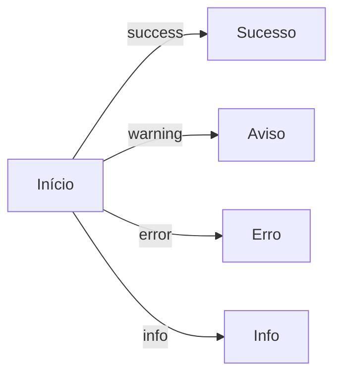

# Padrão de Cores Semânticas para Diagramas

**Versão**: 1.0.0  
**Última Atualização**: 2025-01-30

---

## Visão Geral

Este documento descreve o padrão de cores semânticas implementado para as linhas e conexões dos diagramas no projeto Z-API Central. O padrão foi criado para melhorar a compreensão visual dos diagramas através de codificação por cores baseada em significado.

---

## Sistema de Cores

### Cores Primárias

| Cor | Variável CSS | Valor | Uso |
|-----|--------------|-------|-----|
| **Primary** | `--diagram-line-primary` | `#4a90e2` | Fluxo principal, conexões padrão |
| **Primary Light** | `--diagram-line-primary-light` | `#6ba3f0` | Estado hover/ativo |
| **Primary Dark** | `--diagram-line-primary-dark` | `#2c5aa0` | Estado destacado |

### Cores Semânticas

| Cor | Variável CSS | Valor | Uso |
|-----|--------------|-------|-----|
| **Success** | `--diagram-line-success` | `#10B981` | Sucesso, confirmação, OK, caminho válido |
| **Warning** | `--diagram-line-warning` | `#F59E0B` | Aviso, condição, decisão, caminho condicional |
| **Error** | `--diagram-line-error` | `#EF4444` | Erro, falha, rejeição, caminho inválido |
| **Info** | `--diagram-line-info` | `#3B82F6` | Informação, dados, fluxo de dados |
| **Neutral** | `--diagram-line-neutral` | `#6B7280` | Neutro, dados passivos, informações secundárias |
| **Secondary** | `--diagram-line-secondary` | `#06B6D4` | Fluxo secundário, caminhos alternativos |

### Variantes Light/Dark

Cada cor semântica possui variantes `-light` e `-dark` para estados hover e destacados:

- `--diagram-line-success-light` / `--diagram-line-success-dark`
- `--diagram-line-warning-light` / `--diagram-line-warning-dark`
- `--diagram-line-error-light` / `--diagram-line-error-dark`
- `--diagram-line-info-light` / `--diagram-line-info-dark`
- `--diagram-line-neutral-light` / `--diagram-line-neutral-dark`
- `--diagram-line-secondary-light` / `--diagram-line-secondary-dark`

### Dark Mode

Todas as cores possuem variantes específicas para dark mode com melhor contraste:

- `--diagram-line-primary-dark-mode`
- `--diagram-line-success-dark-mode`
- `--diagram-line-warning-dark-mode`
- `--diagram-line-error-dark-mode`
- `--diagram-line-info-dark-mode`
- `--diagram-line-neutral-dark-mode`
- `--diagram-line-secondary-dark-mode`

---

## Uso por Tipo de Diagrama

### Mermaid Diagrams

As cores são aplicadas automaticamente através de classes CSS. Para usar cores semânticas em diagramas Mermaid, adicione classes às linhas:



**Nota**: O suporte a classes em Mermaid pode variar. Para controle total, use variáveis CSS diretamente no código do diagrama ou estilize via CSS.

### InteractiveFlowDiagram (React Flow)

Use a propriedade `type` nas edges para aplicar cores semânticas:

```tsx
<InteractiveFlowDiagram
  nodes={[
    { id: '1', label: 'Início', type: 'input' },
    { id: '2', label: 'Processo', type: 'default' },
    { id: '3', label: 'Sucesso', type: 'output' },
  ]}
  edges={[
    { from: '1', to: '2', label: 'Fluxo principal', type: 'default' },
    { from: '2', to: '3', label: 'Sucesso', type: 'success' },
    { from: '2', to: '4', label: 'Erro', type: 'error' },
  ]}
/>
```

**Tipos disponíveis**:
- `default` - Cor primária (azul)
- `success` - Verde
- `warning` - Laranja
- `error` - Vermelho
- `info` - Azul info
- `neutral` - Cinza
- `secondary` - Ciano

### AnimatedFlow

Use a propriedade `color` nos steps para aplicar cores semânticas:

```tsx
<AnimatedFlow
  steps={[
    { icon: Check, label: 'Passo 1', color: 'var(--diagram-line-success)' },
    { icon: Alert, label: 'Passo 2', color: 'var(--diagram-line-warning)' },
    { icon: X, label: 'Passo 3', color: 'var(--diagram-line-error)' },
  ]}
/>
```

---

## Guia de Uso Semântico

### Quando usar cada cor

#### Primary (Azul - `#4a90e2`)
- Fluxo principal do processo
- Conexões padrão entre componentes
- Sequência normal de operações

#### Success (Verde - `#10B981`)
- Operações bem-sucedidas
- Confirmações
- Caminhos válidos
- Estados de sucesso

#### Warning (Laranja - `#F59E0B`)
- Condições que requerem atenção
- Decisões/ramificações
- Caminhos condicionais
- Estados de aviso

#### Error (Vermelho - `#EF4444`)
- Erros e falhas
- Rejeições
- Caminhos inválidos
- Estados de erro

#### Info (Azul Info - `#3B82F6`)
- Fluxo de informações
- Dados sendo transmitidos
- Operações informativas
- Estados informativos

#### Neutral (Cinza - `#6B7280`)
- Dados passivos
- Informações secundárias
- Conexões neutras
- Estados sem significado especial

#### Secondary (Ciano - `#06B6D4`)
- Fluxos secundários
- Caminhos alternativos
- Operações auxiliares

---

## Exemplos Práticos

### Exemplo 1: Fluxo de Autenticação

```tsx
<InteractiveFlowDiagram
  nodes={[
    { id: 'login', label: 'Login', type: 'input' },
    { id: 'validate', label: 'Validar', type: 'default' },
    { id: 'success', label: 'Autenticado', type: 'output' },
    { id: 'error', label: 'Erro', type: 'output' },
  ]}
  edges={[
    { from: 'login', to: 'validate', type: 'default' },
    { from: 'validate', to: 'success', label: 'Válido', type: 'success' },
    { from: 'validate', to: 'error', label: 'Inválido', type: 'error' },
  ]}
/>
```

### Exemplo 2: Processo com Decisão

```tsx
<InteractiveFlowDiagram
  nodes={[
    { id: 'start', label: 'Início', type: 'input' },
    { id: 'check', label: 'Verificar', type: 'default' },
    { id: 'yes', label: 'Sim', type: 'output' },
    { id: 'no', label: 'Não', type: 'output' },
  ]}
  edges={[
    { from: 'start', to: 'check', type: 'default' },
    { from: 'check', to: 'yes', label: 'Condição OK', type: 'success' },
    { from: 'check', to: 'no', label: 'Atenção', type: 'warning' },
  ]}
/>
```

---

## Acessibilidade

### Contraste

Todas as cores foram escolhidas para atender aos requisitos de contraste WCAG 2.1 AA:

- **Light Mode**: Contraste mínimo de 4.5:1 sobre fundo branco
- **Dark Mode**: Variantes ajustadas para contraste mínimo de 4.5:1 sobre fundo escuro

### Suporte a Dark Mode

O sistema detecta automaticamente o tema e aplica as variantes apropriadas:

```css
[data-theme='dark'] .mermaid .edgePath .path {
  stroke: var(--diagram-line-primary-dark-mode);
}
```

### Prefers-Reduced-Motion

As animações respeitam a preferência do usuário:

```css
@media (prefers-reduced-motion: reduce) {
  .mermaid .edgePath .path {
    animation: none;
  }
}
```

---

## Customização

### Alterando Cores Globais

Para alterar as cores em todo o projeto, edite as variáveis CSS em `src/css/custom.css`:

```css
:root {
  --diagram-line-primary: #sua-cor-aqui;
  --diagram-line-success: #sua-cor-aqui;
  /* ... */
}
```

### Cores Customizadas por Componente

Para cores específicas de um componente, use variáveis CSS locais:

```tsx
<div style={{ '--diagram-line-primary': '#custom-color' } as React.CSSProperties}>
  <InteractiveFlowDiagram ... />
</div>
```

---

## Manutenção

### Adicionando Novas Cores

1. Adicione a variável CSS em `src/css/custom.css`
2. Adicione a variante dark mode
3. Atualize os componentes que usam cores
4. Documente o uso da nova cor neste arquivo

### Testando Cores

Sempre teste as cores em:
- Light mode
- Dark mode
- Diferentes tamanhos de tela
- Com diferentes tipos de conteúdo

---

## Referências

- [WCAG 2.1 Guidelines](https://www.w3.org/WAI/WCAG21/quickref/)
- [Color Contrast Checker](https://webaim.org/resources/contrastchecker/)
- [Mermaid Documentation](https://mermaid.js.org/)
- [React Flow Documentation](https://reactflow.dev/)

---

**Versão**: 1.0.0  
**Última Atualização**: 2025-01-30
